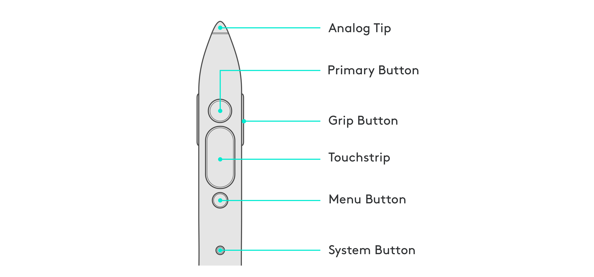
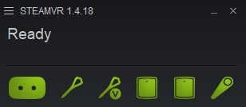

# Get to know your device

Here is a descriptions of the different buttons and input available on the Logitech VR Ink, they will be referenced throughout this getting started guide as well as in the design guidelines and code examples.

| Control | Description |
|----|---------------|
| Primary Button | The Primary Button allows for modulated input that can present a range of values. This can be used for creating variable line widths in the air based on the pressure applied to the button, or interacting with UI. |
| Analog Tip | The Analog Tip allows for the creation of lines on physical surfaces that are mapped in VR. This can be used to recreate a drawing surface on a desk or a whiteboard. |
| Touchstrip | The Touchstrip is capacitive sensing and has a button to allow for multiple methods of input. It can be used for the adjustment of controls using up and down swipes or executing mapped controls based on touch position. |
| Grip Button | The Grip Button on the sides of the VR Ink allow users to intuitively pick objects up in VR, and to scale and move objects using a system controller (Vive controller or Index Controller) in the non-dominant hand. |
| Menu Button | The Menu Button is a simple switch button, and can be used for tertiary controls like opening a menu. |
| System Button | The System button allows for access to the SteamVR shell, and powering the device on and off. |

# Setting up the VR Ink
To ensure the VR Ink works in applications and appears correctly in the SteamVR shell and status window, an initial installation is required.

## Using the Installer
Download the VR Ink Driver Installer from the releases [page](https://github.com/Logitech/labs_vr_stylus_sdk/releases), run the application, and follow the instructions on screen. After installing, restart SteamVR and ensure the VR Ink is paired. You should see the VR Ink in the SteamVR shell and the updated icons in the status window.

## Pairing the VR Ink
  1. First turn on the VR Ink by pressing the system button, the status LED should appear blue if it is not currently paired to a system.
  2. In the SteamVR status window, right click on a controller icon and select 'Pair Controller'.
  3. Press both the Menu and Power buttons on the VR Ink for a few seconds until the status LED starts blinking blue.
  4. When the VR Ink is successfully paired, the LED will appear as a solid green.

# Next Steps
After your VR Ink is set up, we highly recommend that you check out our Demo Experience.

