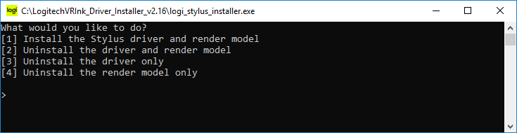

# Get to know your device

Here is a descriptions of the different buttons and inputs available on the Logitech VR Ink, they will be referenced throughout this guide as well as in the design guidelines and code examples.

| Control | Description |
|----|---------------|
| **Primary Button** | The Primary Button allows for modulated input that can present a range of values. This can be used for creating variable line widths in the air based on the pressure applied to the button, or interacting with UI. |
| **Analog Tip** | The Analog Tip allows for the creation of lines on physical surfaces that are mapped in VR. This can be used to recreate a drawing surface on a desk or a whiteboard. |
| **Touchstrip** | The Touchstrip is capacitive sensing and has a button to allow for multiple methods of input. It can be used for the adjustment of controls using up and down swipes or executing mapped controls based on touch position. |
| **Grip Button** | The Grip Button on the sides of the VR Ink allows users to intuitively pick objects up in VR, and to scale and move objects using a system controller (Vive controller or Index Controller) in the non-dominant hand. |
| **Menu Button** | The Menu Button is a simple switch button, and can be used for tertiary controls like opening a menu. |
| **System Button** | The System button allows for access to the SteamVR shell, and powering the device on and off. |

# Setting up the VR Ink
To ensure the VR Ink works in applications and appears correctly in the SteamVR shell and status window, an initial installation is required. Follow these easy three steps as described below.

## 1. Install the driver
- Download the latest VR Ink Driver [(version 2.16)](https://github.com/Logitech/labs_vr_stylus_sdk/releases/download/v2.0.0/LogitechVRInk_Driver_Installer_v2.16.zip) Installer from the releases [page](https://github.com/Logitech/labs_vr_stylus_sdk/releases)
- Unzip it anywhere on your machine.

- Run the installer exe application, and follow the instructions on screen. Select Option "1".

 

- After successful install, restart SteamVR. 
- The dashboard should look like the one below. You'll notice the greyed out icon for the Driver's virtual device: that's all ok.

- Then pair your VR Ink following the steps described below.

If you want to know more about the features of the SW driver, click on Driver Icon here below.  

## 2. Pairing the VR Ink
- First turn on the VR Ink by pressing the system button, the status LED should appear blue if it is not currently paired to a system.
- In the SteamVR status window, right click on a controller icon and select 'Pair Controller'.
- Press (and hold) both the Menu and Power buttons on the VR Ink for a few seconds until the status LED starts blinking blue.
- When the VR Ink is successfully paired, the LED will appear as a solid green.
- Now, If you wear the HMD, you should see the VR Ink renderModel in SteamVR Shell.
- You should also see the VR Ink updated icons in SteamVR status window. You'll note now that both the icons for VR Ink are active.

## 3. Using VR Ink
After your VR Ink is set up, we highly recommend that you check out our Demo App or dive into the Unity or Unreal integration guides.

