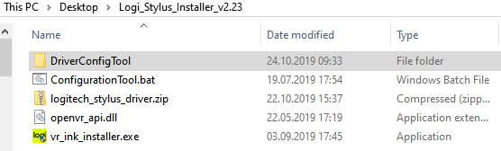
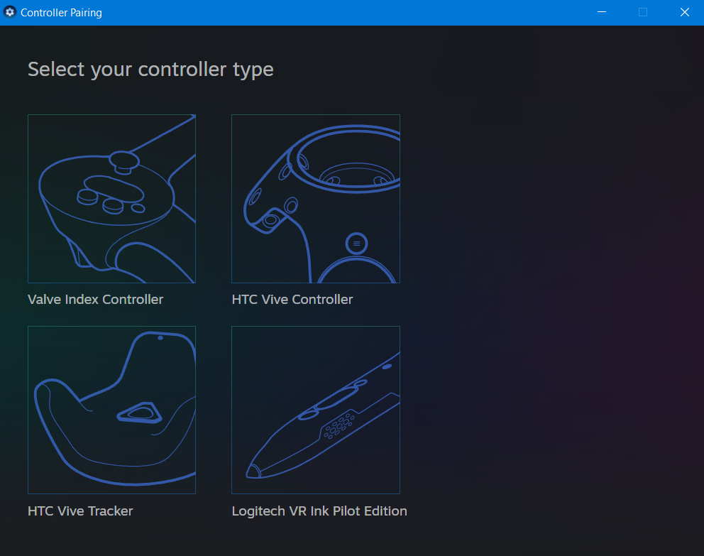

# Get to Know Your Device
Here are descriptions of the different buttons and inputs available with Logitech VR Ink. They will be referenced throughout this guide as well as in the design guidelines, code examples and in other parts of the SDK.

| 
Control
 | Description |
|----|---------------|
| **Primary Button** | The Primary Button allows for modulated input that can report a range of values. This can be used for creating variable line widths in the air based on the pressure applied to the button, or interacting with UI. |
| **Analog Tip** | The Analog Tip allows for the creation of lines on physical surfaces that are mapped in VR. This can be used to recreate a drawing surface on a desk or a whiteboard. |
| **Touchstrip** | The Touchstrip is capacitive sensing, and has a button, to allow for multiple methods of input. It can be used for the adjustment of controls using up and down swipes or executing mapped controls based on touch position. |
| **Grip Button** | The Grip Button on the sides of VR Ink allows users to intuitively pick objects up in VR, and to scale and move objects using a system controller (Vive controller or Index Controller) in the non-dominant hand. |
| **Menu Button** | The Menu Button is a simple switch button, and can be used for tertiary controls like opening a menu. |
| **System Button** | The System button allows for access to the SteamVR shell, and powering the device on and off. |

# Setting up VR Ink
To ensure VR Ink works in applications and appears correctly in the SteamVR shell and status window, an initial installation is required.

## 1. Install the Driver
1. Download the latest VR Ink Driver Installer from the [releases page](https://github.com/Logitech/vr_ink_sdk/releases).
2. Unzip it anywhere on your machine.
    
   

3. Run the installer exe application, and follow the instructions on screen. Select Option '1'.
    
   
    
   

4. After successful install, restart SteamVR.
5. The dashboard should look like the one below. You'll notice the greyed out icon for the VR Ink Device's driver: that's all ok.
    
   

6. Then pair your VR Ink following the steps described below.

## 2. Pairing VR Ink
1. If you already have two controllers paired and connected, **first turn OFF the one you want to replace** the VR Ink with (ex: the right one if you're right-handed pen user)
2. turn on VR Ink by pressing the system button for about a second. The status LED should appear blue if it is not currently paired to a system.
3. In the SteamVR status window, right click on (any) controller icon and select **Pair Controller**. 

4. Click on the button **"I want to pair a different type of controller ..."**

5. Click on the **Logitech VR Ink** section (available from SteamVR 1.9 version) and follow the instructions.

6. Press (and hold) both the **MENU** and **SYSTEM** buttons on VR Ink for a few seconds until the status LED starts blinking blue.

7. When VR Ink is successfully paired, the LED will appear as a **solid green**.
8. You should also see updated VR Ink icons in SteamVR status window. You'll note now that both the icons for VR Ink stylus are active.
    
   

9. Now, If you wear the HMD you should see the VR Ink model in the SteamVR Shell.

## 3. Using VR Ink
After your VR Ink is set up, we highly recommend that you check out our Demo App or dive into the Unity, Unreal or Native integration guides.

If you want to know more about the features of the VR Ink driver, click on Driver Icon here below.
 

