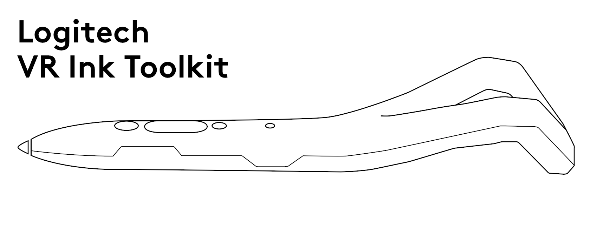
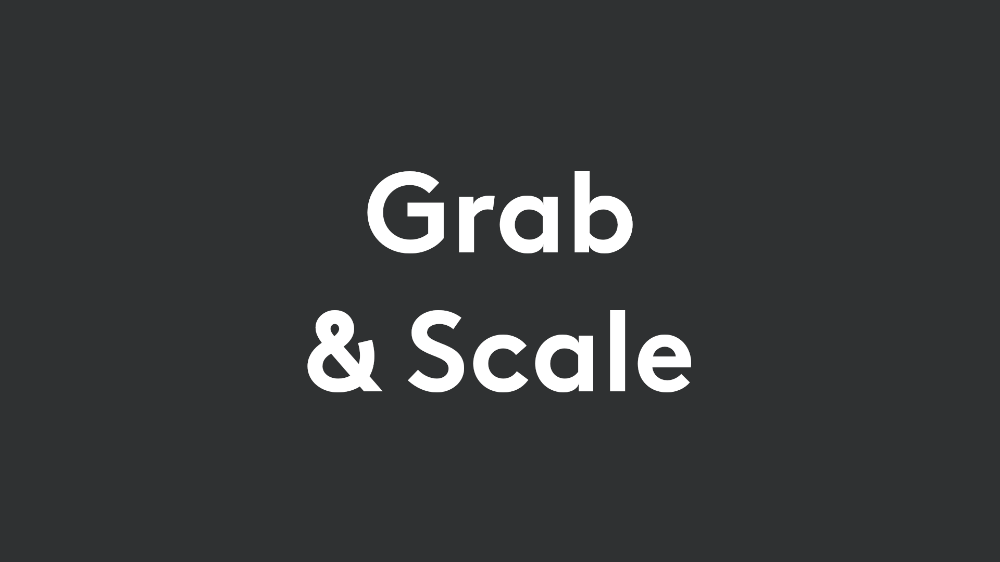
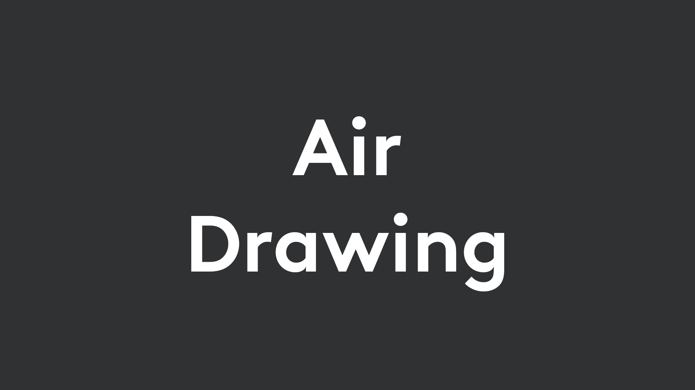
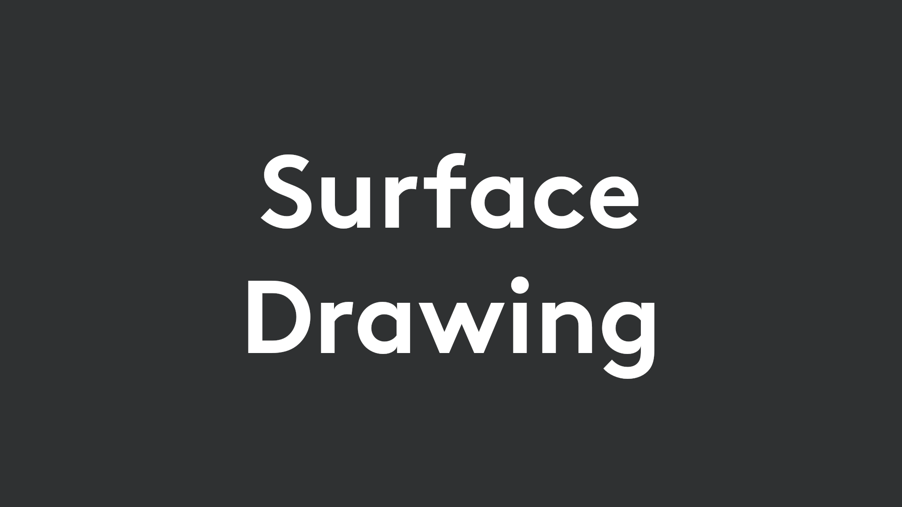
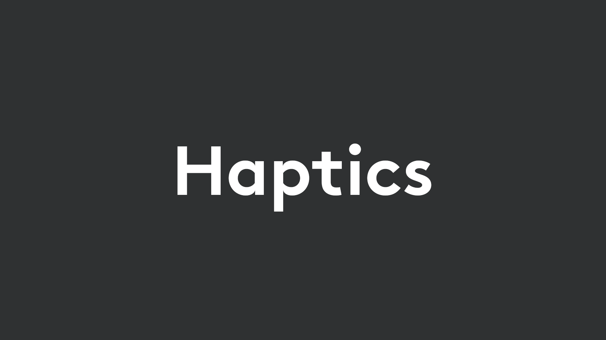
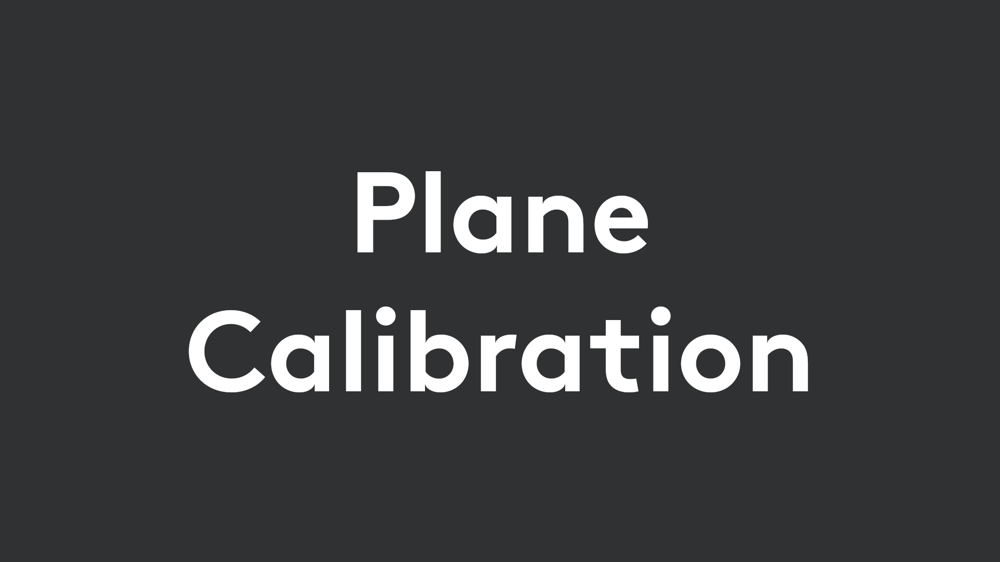
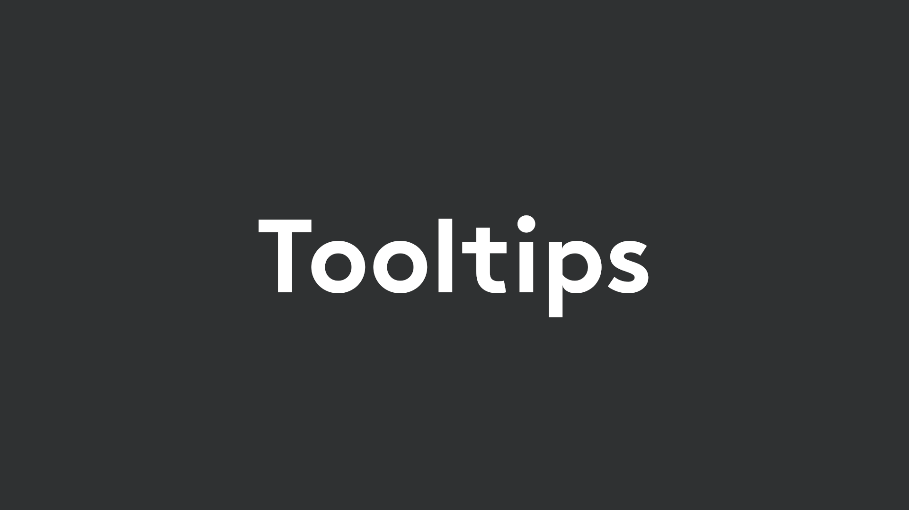
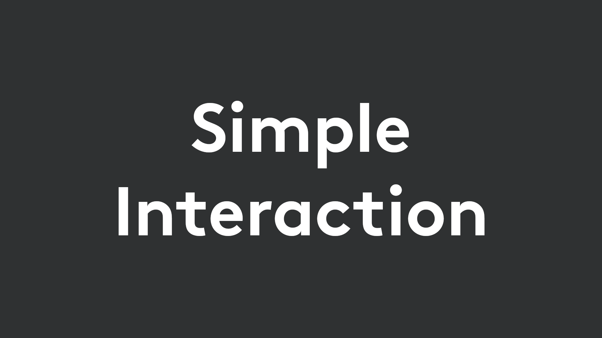

# Logitech VR Ink Toolkit
The Logitech VR Ink Toolkit demonstrates some key interactions and capabilities of the VR Ink and presents best practices to partners and developers. It also includes accompanying code examples.

The Toolkit is built using Unity, but the concepts and interactions presented here may be transferred to another platform such as Unreal Engine.

## Design Guidelines
We recommend that you follow our [design guidelines](../../Documentation/DesignGuidelines) when integrating or creating interactions for the VR Ink. You can find examples of their implementation in the Toolkit modules below.

## Getting Started with the Toolkit
You can get the Toolkit by downloading the 'Toolkit' folder in the SDK, or by downloading and importing the Unity package from the [latest release](https://github.com/Logitech/labs_vr_stylus_sdk/releases).

## Toolkit Interaction Modules
These modules of the Toolkit showcase how to create some key interactions with the VR Ink. *Detailed documentation on each of these modules will be available soon.*

## Example Scenes
Along with example scenes for each module, there are two more scenes.

**Bare bones Scene**
 
If you have a clear design direction already in mind and just want to get started from the bare minimum, we provide a bare bones scene that features the VR Ink model and the correct pose information, and is ready to begin building custom interactions and experiences.
 

**All-in-One Scene**
 
The All-in-One scene is designed to show all the key interactions and how they can work together to build creative applications.
 

## Technical Documentation
Documentation on the lightweight framework and the components used in the Toolkit will be added later.
