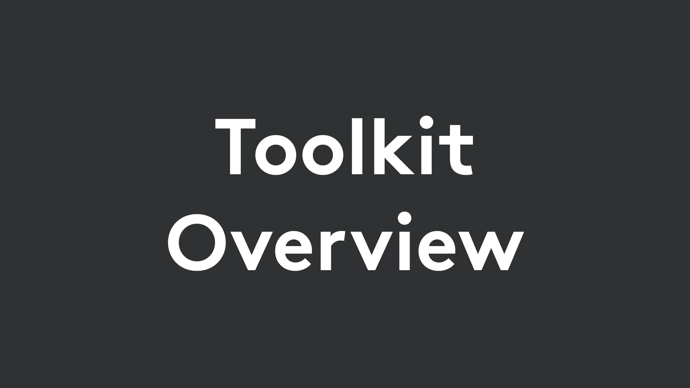

# Logitech VR Ink Toolkit
The Logitech VR Ink Toolkit demonstrates some key interactions and capabilities of VR Ink and presents best practices to partners and developers, using a lightweight framework that allows you to build your own interactions as well. Accompanying code examples are included.

The Toolkit is built using Unity, but the concepts and interactions presented here may be transferred to another platform such as Unreal Engine.

## Design Guidelines
As a starting point, we recommend that you follow our [design guidelines](../../Documentation/DesignGuidelines) when integrating or creating interactions for VR Ink. You can find examples of their implementation in the Toolkit modules below.

## Getting Started
You can get the Toolkit by downloading this folder, or by downloading and importing the Unity package from the [releases page](https://github.com/Logitech/vr_ink_sdk/releases). Note that the Toolkit is not compatible with the Unity Integration section of the SDK. It uses the Unity SteamVR plugin version 2.0+ with the SteamVR action bindings.

### Toolkit Overview

Before using the Toolkit in Unity, we recommend that you check out the [Toolkit Overview](../../Documentation/Toolkit/ToolkitOverview.md) page for a run down on what's included in the Toolkit and how it works.
 

## Interaction Modules
These modules of the Toolkit showcase how to create some key interactions with VR Ink. Each module has its own example scene.

## Example Scenes
Along with example scenes for each module, there are two more scenes.

### All-in-One
The All-in-One scene is designed to show all the key interactions and how they can work together to build creative applications. It can be found in `Toolkit/Examples/ExampleInteractions/1_Example_All_In_One`.

### Simple Interaction
If you have a clear design direction already in mind and just want to get started from the bare minimum, we provide a bare bones scene that features the VR Ink model and the correct pose information, and is ready to begin building custom interactions and experiences. It contains a basic interaction using the Toolkit framework to help you get started building your own interactions. The scene can be found in `Toolkit/Examples/ExampleInteractions/2_Example_SimpleInteraction`.
