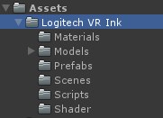
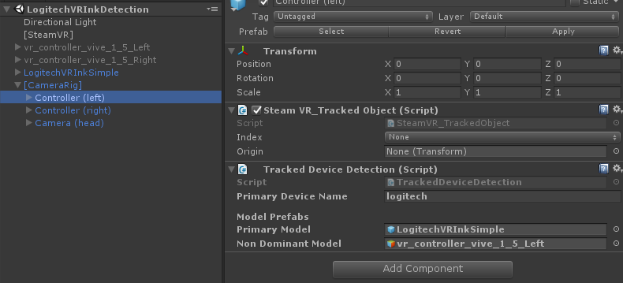
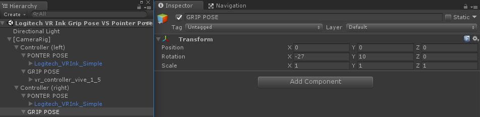

# Integration in Unity using Legacy SteamVR Input
**This Unity Project works with the deprecated [SteamVR Plugin](https://github.com/ValveSoftware/steamvr_unity_plugin/releases/tag/1.2.3).**  It does not support SteamVR Input 2.0 and action maps.
  

## Adding Logitech VR Ink to Your Project

This example has been developed and tested using Unity 2017 LTS, but it should also work with newer versions of the Unity.

### Starting with a new project

If you are starting a project from scratch, we recommend that you follow the SteamVR 2.0 Input System Unity sample available in the SDK. Get started [here](../../UnitySampleProjects/UnitySample_SteamVR2.0/).

If you want to start with a new project using the legacy SteamVR Input System, the best place to start would be to download or clone this project and extract this folder (UnitySample_LegacySteamVR) as a Unity project.

### Adding support to an existing project

If you have an existing project using legacy SteamVR, you can download the Unity Package available on the [releases page](https://github.com/Logitech/labs_vr_stylus_sdk/releases). It will contain the `Logitech VR Ink` folder that contains all the required assets as well as the sample scenes.

## Plugin Content

All the useful content is contained in the `Logitech VR Ink` folder, this will make it easy to add/remove Logitech VR Ink support to your project.

The following section will go through the contents of the three sample scenes we provide.

## Logitech VR Ink Models

Open the scene `Logitech VR Ink Models`.
This is a very minimal scene where you can find the models that we share with the SDK.

**We recommend using the simple model** without the tracking the geometry at the back.

You will find that there's two prefabs available to use, `Logitech_VRInk_Full` and `Logitech_VRInk_Simple`, these prefabs also have the button animation and feedback built-in. If you enter play mode and press the different buttons on the device you should see that they animate. You can find more details about the highlighting scheme in [the design guidelines](Documentation/DesignGuidelines).

You can also download the FBX source files & textures from the [latest release](https://github.com/Logitech/labs_vr_stylus_sdk/releases).

### Implementation

To create the button accents on the models shown above, we assign two materials to the same mesh. The accent will overlap the base material for the models.
 

For the `LogitechVRInk_ButtonsOutline` material, we have created a custom shader that allows you to change the color of the outline while having a transparent material that you can find under `Logitech/Transparent Colored`.

There are two script in charge of the button animation: `LogitechStylusButtonAnimation.cs` and `LogitechStylusAnalogAnimation.cs`.
These two scripts directly ask OpenVR for the input of a connected Logitech VR Ink, that means that you can take the prefabs and add them into any new scenes and the button animation will work out of the box.

## Logitech VR Ink Detection

When working with a cross platform VR application you can usually use the Unity APIs to determine if you are on the Vive platform, Oculus Platform or Windows MR platform.
When working with VR Ink, it is a little different as VR Ink may work in conjunction with another controller such as a Vive Controller or Index controller.
This means that you need to be able to detect when the Stylus is connected and plugged in to load the correct model and potentially modifications to the interactions and UI.

### Implementation

To detect that the Logitech VR Ink is connected when you start up your application you can ask SteamVR what are the device properties of a specific `SteamVR_Tracked_Object`. All the logic for detecting the Logitech VR Ink is inside the `LogitechStylusDetection` script.

We recommend that you use the **ModelNumber_String property** to detect if the pen is connected. You can detect if VR Ink is connected using the *logitech_* string. When you have the game window in focus you can **press P** on the keyboard to print the different property strings in the Unity console.

## Grip Pose VS Pointer Pose

It is important to be familiar with the Microsoft documentation ([grip vs pointer pose](https://docs.microsoft.com/en-us/windows/mixed-reality/gestures-and-motion-controllers-in-unity#grip-pose-vs-pointing-pose)) regarding the different type of poses that you could define for a 6DOF controller.

In the scene `Logitech VR Ink Grip Pose VS Pointer Pose`, you see `Pointer pose` and `Grip Pose` in the hierarchy under the `[CameraRig]`. If your application **displays real hands** it is recommended to use the `Grip Pose` transform to display the 3D model of the hands.

The Grip pose for VR Ink is defined as in the screenshot below:
 

