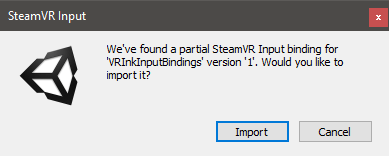
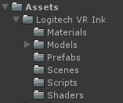
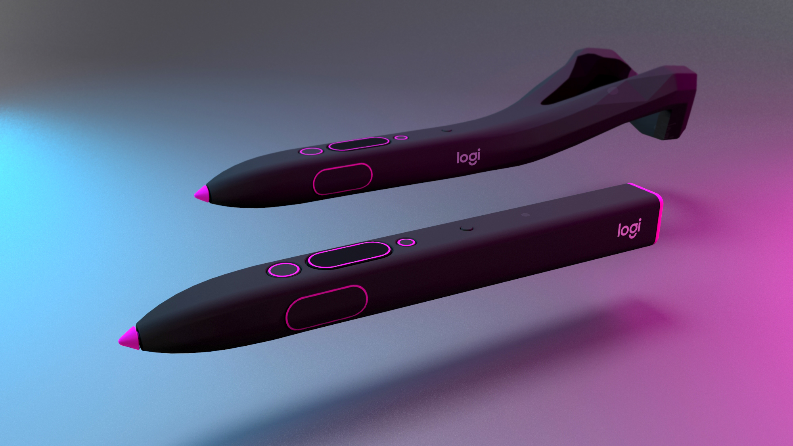
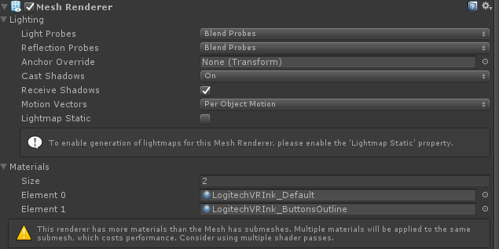

# Integration in Unity using SteamVR 2.0 Input System
**This Unity Project works with the newer [SteamVR 2.0 input system](https://github.com/ValveSoftware/steamvr_unity_plugin/releases/tag/2.2.0).**
 
We use the SteamVR Unity plugin version 2.2.0 here, but it should work with newer versions too.

## Adding Logitech VR Ink to your project
This example has been developed and tested using Unity LTS 2017, but it should also work with newer versions of the engine.

### Starting with a new project
Start by downloading or cloning this project and extracting this folder (UnitySample_SteamVR2.0) as a Unity project. The Unity project here provides the default input bindings, and should work out of the box.

### Adding support to an existing project
If you have an existing project using SteamVR 2.0, you can download the Unity Package available in the [latest release](https://github.com/Logitech/labs_vr_stylus_sdk/releases). It will contain the `Logitech VR Ink` folder that has all the required assets as well as some sample scenes.

When you import the Unity Package to your own project you will be prompted to import the partial bindings `VRInkInputBindings`. For the VR Ink to work with your project, you can choose to replace your current bindings or to merge them. Otherwise you will have to setup the bindings yourself.

If you choose not to import the partial bindings, you can delete the `SteamVR_VRInkInputBindings` folder to prevent the prompt from reappearing.

## Plugin Content
All the useful content is contained in the `Logitech VR Ink` folder, this will make it easy to add/remove Logitech VR Ink support in your project.

## Logitech VR Ink Models
Open the scene `LogitechVRInkModels`.
This is a very minimal scene where you can find the models that we share with the SDK.

**We recommend using the simple model** without the tracking the geometry at the back.
 

You will find that there's two prefabs available to use, `LogitechVRInkFull` and `LogitechVRInkSimple`. These prefabs will have the button animation and feedback built-in. If you enter play mode and press the different buttons on the device you should see that they animate. You can find more details about the visual feedback in [the design guidelines](../../../Documentation/DesignGuidelines).

You can also download the FBX source files & textures from the [latest release](https://github.com/Logitech/labs_vr_stylus_sdk/releases).

### Implementation
To create that outline effect on the models, we assigned two materials to the same mesh and these will overlap on the object.

For the `LogitechVRInk_ButtonsOutline` material we have created a custom shader that allows you to change the color of the outline while having a transparent material that you can find under `"Logitech/Transparent Coloured"`.

In a next iteration of the SDK we will provide a new custom shader that will combine the standard shader with our outline shader to remove the need to apply two separate materials to the mesh.

There are three scripts that provide input visual feedback: `ButtonVisualFeedback.cs`, `StylusPrimaryVisualFeedback.cs` and `TouchPositionFeedback.cs`.
These scripts use an action binding to get input from a connected device such as the VR Ink. Just assign the desired actions to these inputs and save the prefabs. If use Stylus detection is enabled, the `LogitechStylusDetection` component will have to be placed somewhere in the scene. Otherwise you may set the `SteamVR Input Source` field.

## Logitech VR Ink Detection
When working with a cross platform VR application you can usually use the Unity APIs to determine if you are on the Vive platform, Oculus Platform or Windows MR platform.
When working with the VR Ink it is a little different because the VR Ink works in conjunction with a Vive controller or Index controller.
This means that you need to be able to detect when the Stylus is connected and plugged in to load the correct model and, potentially, modifications to the interactions and UI.

### Implementation
To detect that the Logitech VR Ink is connected when you start up your application you can ask SteamVR what the device properties of a specific `SteamVR_TrackedObject` are. All the logic for detecting the VR Ink is inside the `LogitechStylusDetection` script. This script can be placed anywhere in the scene (it can be found on the `[CameraRig]` in the `LogitechVRInkDetection` scene). It is used to get which `SteamVR_Input_Source` the VR Ink belongs to, which can be used to get input from the VR Ink.

We recommend that you use the **ModelNumber_String property** to detect if the pen is connected. You can detect if the VR Ink is connected using the *logitech* string.