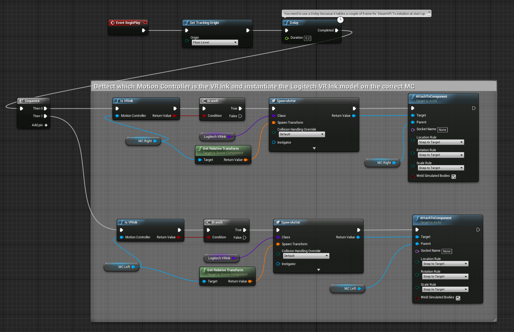

# Unreal Engine Integration

**Note: You need to have a code project to use this plugin.**

This plugin supports  **Unreal Engine 4.19** and above.

## Before You Start

We recommend that you:

- Follow these [**design guidelines**](../../Documentation/DesignGuidelines) when integrating or creating interactions for VR Ink.
- Look at the examples of their implementation in the [**VR Ink Toolkit**](../../Assets/Toolkit).

## Adding the Plugin to Your Project

### Starting with a new project

The plugin has been tested using the Virtual Reality template, so start by selecting the Virtual Reality template project, starter content is not necessary.
If you have selected a *blueprint only* project you need to convert it to a C++ project:

1. In the Unreal editor select: `File-> New C++ Class`.
2. In the *Choose Parent Class* dialog choose `Game Mode Base`.
3. Give the class a name of your choice, the solution will open in Visual Studio.
4. Close Visual studio and the Unreal Editor.
5. Follow the steps bellow to add the plugin to your new project!

### Add the plugin to an existing project

Start by downloading the plugin from the [release page](https://github.com/Logitech/labs_vr_stylus_sdk/releases).
To manually add the plugin:

1. In your Unreal project's root directory (the one with the `.uproject` file), create a new folder and call it `Plugins`. If you already have a `Plugins` folder you can ignore this step.
2. Unzip the downloaded file directly in the `Plugins` folder.
3. In the root folder of your project right on your `.uproject` file and select `Generate Visual Studio project files`.
4. To launch the project now double-click the `.uproject` file, if prompted to recompile/rebuild any file just select yes.

## Plugin Content

To see the Plugin content in your own project be sure to have checked the `Show Plugin Content` in the content browser.

### Logitech VR Ink models

We provide you with two models of the Logitech VR Ink: a full model with the tracking geometry and a simplified one.

**We recommend using the simple model.**

You will find two blueprint classes, `BP_LogitechVRInk_Full` and `BP_LogitechVRInk_Simple` as well as all the static meshes component, textures and materials. You can download the FBX source and textures from the [release page](https://github.com/Logitech/labs_vr_stylus_sdk/releases).

### Logitech VR Ink Map

This is the example scene provided to showcase the usage of the plugin. You will notice that we also have created a custom VR Pawn Blueprint class called `BP_LogitechVRInk_Pawn`. This is the blueprint we have used to give an example of how to use our custom Blueprint Library class.
If you run that level with a Logitech VR Ink connected you should see the correct VR Ink model spawning.

### Logitech VR Ink Library

Intentionally kept very simple, the few lines of code included in this SDK can be found in `LogitechVRInk\Source\LogitechVRInk`. Right now there's only one function, `IsVRInk()`, that asks OpenVR if the provided `Motion Controller component` is a Logitech VR Ink.
This library will be extended in the future and we will add more features as we get feedback from the community.

## Detecting the Logitech VR Ink

When working with a cross platform VR application you can usually use the Unreal APIs to determine if you are on the Vive platform, Oculus Platform or Windows MR platform.
When working with VR Ink it is a little different because VR Ink works in conjunction with an other Vive Controller, or Index controller.
This means that you need to be able to detect when the Stylus is connected and plugged in to load the correct model and potentially modifications to the interactions and UI.

You can call the `IsVRInk()` function at any point to assess if a given motion controller is a VR Ink except on the `Event Begin play` callback from UnrealEngine.
This is because on the starting frame Unreal Engine has yet to properly initialize its `Motion Controller Components`.
You will see in the `BP_LogitechVRInk_Pawn` that we call `IsVRInk()` **after a delay**.

We recommend that you use the `IsVRInk()` function in your Pawn blueprint to detect if a VR Ink is connected. Once you have found that the stylus is connected you would adjust the functionality and UI of your application accordingly.

## Useful Information

- Configure a VR Player Pawn: [UE Doc](https://docs.unrealengine.com/en-US/Platforms/VR/SteamVR/HowTo/StandingCamera/index.html)
- Configure left and right motion controller [UE Doc](https://docs.unrealengine.com/en-US/Platforms/VR/DevelopVR/MotionController/index.html)
- When the plugin is correctly loaded you will be able to access the Logitech VR Ink blueprint library from any blueprint classes.
 

- If you are making a VR Pawn from scratch  you will need to add a public variable to your pawn blueprint to set the Logitech VR Ink in the `Details View`. Your new variable should look like this:
 

- Make sure that you have set a actor to be spawned in the `Details View` and also make sure that you have set the `Auto Possess` field to Player 0.
 

