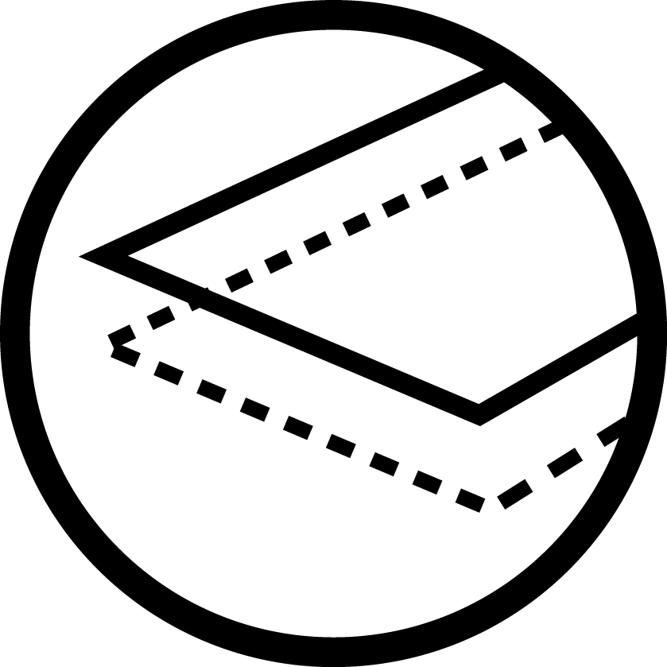
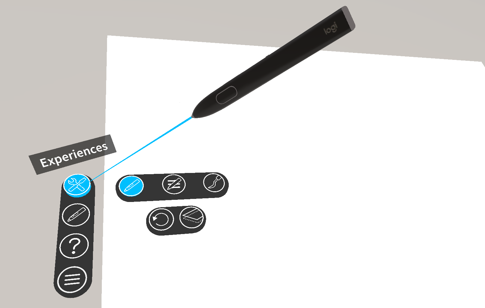
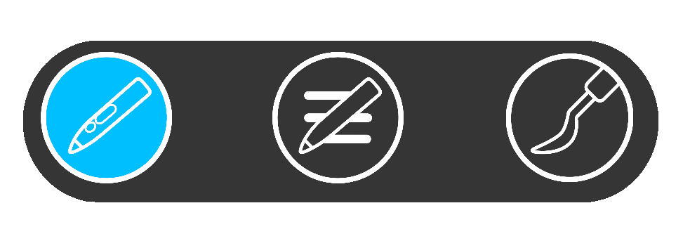
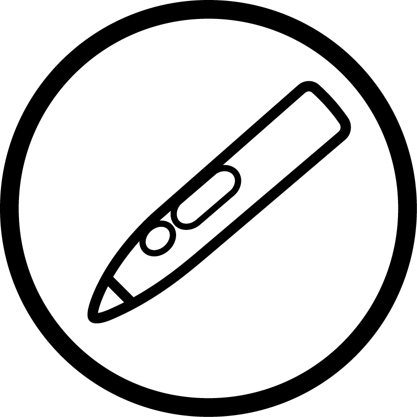
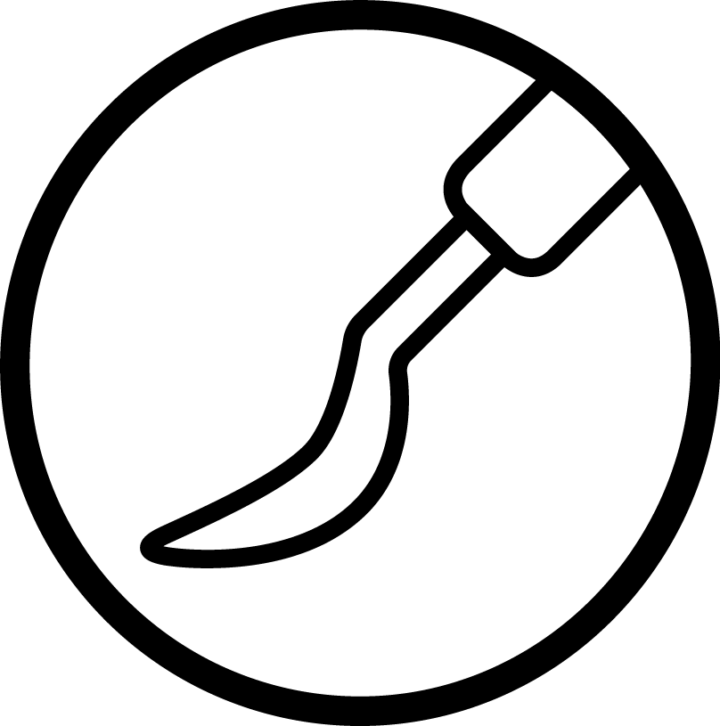
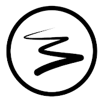
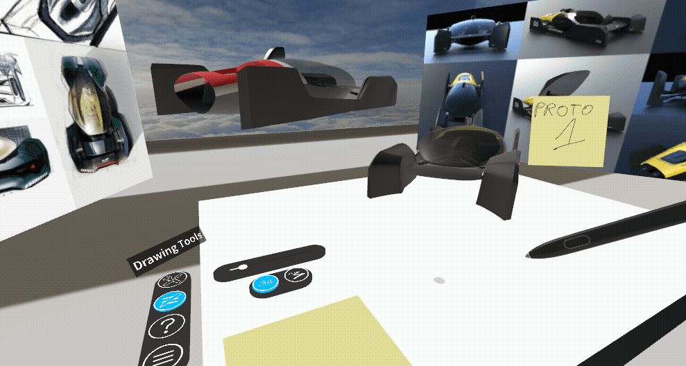
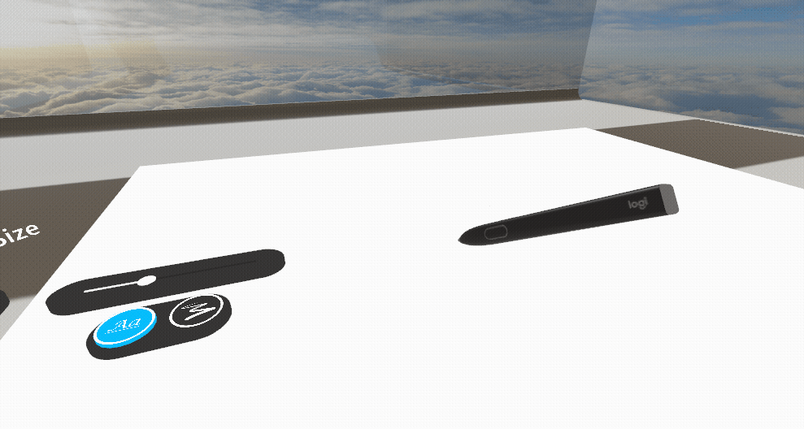

# Demo App: experience the Logitech VR Ink

This application is meant as the first contact experience when using the Logitech VR Ink. It showcases several **interactions that are unique to the stylus**. It is a very good way to experiment and get familiar with the VR Ink experience.

## Install

1. Download the [latest version of the Logitech Demo Experience](https://github.com/Logitech/vr_ink_sdk/releases).
2. Unzip it on your drive.
3. Make sure SteamVR is running and VR Ink (and a controller) are paired and connected.
4. Run the `Logitech_Demo_Experience.exe`.

## Try it out

For a optimum experience you will need to have a **desk with a flat area of 60x80cm (A1)** that is free of any objects and offers good gliding conditions (textured surfaces will affect the tracking performance).
Once you have that space, you'll need to calibrate it. Calibration will be stored so you don't have to do it again next time, though you can still run it again if needed.

## Calibrating the Space

On the **Experiences Menu** select  to go into calibration mode. Then **press the VR Ink primary button** while holding the VR Ink tip in each of the 3 points of your desired space. This will align the virtual canvas with real 2D surface in front of you.

## Try out different Experiences
You can select the Experience menu by clicking the appropriate icon with VR Ink on the left side of your drawing surface.

The app will offer three different scenarios that can be accessed by using the Experiences menu, select:

-  to access the Drawing experience

-  to access the Markup experience

-  to access the Sculpting experience

 

## Writing & Drawing Experience

Once the surface is calibrated, you can write in 2D by simply touching the tip of the stylus on the physical surface, or you can draw in the air by pressing the Primary Button with your finger. The harder you press the thicker the line will be.
The Brush Size Slider on the surface will change the maximum thickness of the line. You can also click on the Touchpad and adjust the brush size.

Be sure to check out the two different modes:

|Mode|Description|
|---|---|
|  **Writing mode** | This mode is optimized for handwriting: with finer line, less impact of force and optimized refresh rate. |
| **Drawing mode** | In this mode the user has more control over the width of the line by either applying more pressure on the surface or with the finger in air.  |

## Markup Experience

In this experience your will be able to experience a markup & review situation, typically when you need to review some assets that your team has created. To do so you can:
- **Annotate 3D models** by either directly drawing in 3D space.
- But also by creating **virtual post-its** an write on them. Simply start by writing on the one that is already on the table or grab it around.
- You can also use the Non-Dominand Hand controller for a **handheld menu** and start writing post-it and position them in space.
- Additionally you can use both controller's grab buttons to **scale and move the models**, and if those a close enough you can grab them with just the stylus.

## Sculpting Experience

In this demo, you can model the head model by **adding, subtracting or blending "virtual material"**: Simply point with your stylus to the head and press with your index on the primary button. The harder you press, the bigger the effect on the mesh. You can also use the Grip Buttons on VR Ink to rotate the head.

## Cool Tips 

### Marker Menu

The desk menu is great for a desk experience, but to access some options **even faster** you can use the Marker menu: 
- Press and hold the **Touchstrip button** to make the Marker menu appear in front of VR Ink. 
- Select the option you want by **moving the pen** (left and right).
- **Confirm by releasing** the Touchstrip.

### Shortcuts

In addition to the Navigation menu, you can also use some keyboard shortcuts:

| Shortcut /Keyboard key           | Effect                                                                                                                                | NOTES                                             |
|----------------------------------|---------------------------------------------------------------------------------------------------------------------------------------|---------------------------------------------------|
| Shift + o                        | The environment will change to the calibration mode. Use the Analog Tip to point at the corners of the plinth and then press the primary button. |                                                   |
| 1                                | Switch to Drawing Experience.                                                                                                         |                                                   |
| 2                                | Switch to Markup Experience.                                                                                                          |                                                   |
| 3                                | Switch to Sculpting Experience.                                                                                                       |                                                   |
| 4                                | Swap controllers Handedness.                                                                                                          | Useful only if no Stylus detected by application. |
| Vive controller Trackpad Left    | Undo.                                                                                                                                 | 1 second press to clear everything.               |
| Vive controller Trackpad Right   | Redo.                                                                                                                                 |                                                   |
