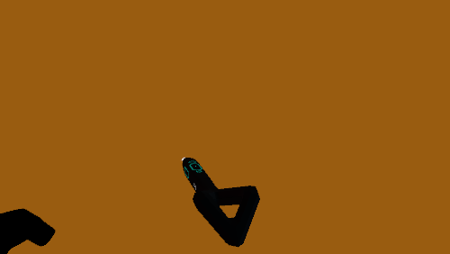
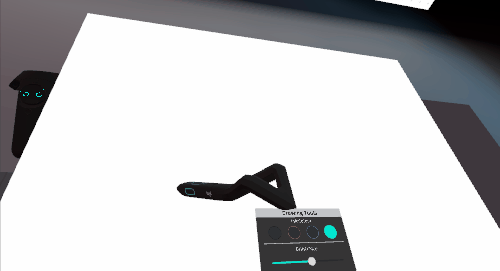

# Sample Demo App: Logitech VR Ink Experience
This application is meant as the first contact experience when using the Logitech VR Ink. It showcases several interactions that are unique to the stylus. It is a very good way to experiment and get familiar with the VR Ink experience.

## Install
- Download the latest: version 1.12 [(download link)](https://github.com/Logitech/labs_vr_stylus_sdk/releases/download/v2.0.0/LogitechDemoExperience_v1.12.zip).
- Unzip it on your drive.
- Make sure SteamVR is running and the VR Ink (and a controller) are paired and connected.
- Run the LogitechDemoExperience.exe.

## Try it
The app will offer three different scenarios that can be accessed by using the keyboard keys:
- press "1" to access the Drawing experience
- press "2" to access the Markup experience
- press "3" to access the Sculpting experience

For a full experience you will need to have a **desk with a flat area of 60x80cm (A1)** that is free of any object and offers good gliding conditions (textured surfaces will impact the tracking performance). 
Once you have that space, you'll need to calibrate it. Calibration will be stored so you don't have to do it again next time. Alternatively it can be run again if you feel like the first one wasn't done properly.

### Calibrating the Space
Press **Shift+o** to go into calibration mode. Then click the touchstrip of the stylus while holding the pen in the 3 corners of you desired space. This will align the virtual canvas with real 2D surface in front of you. 

 

### Drawing Experience

 
Once the surface is calibrated you can draw in 2D by pressing the tip of the stylus on the physical surface, or you can draw in the air by press the main analog button. The harder you press the thicker the line.
The brushsize Slider will change the maximum thickness of the line.

### Markup Experience

 
On top of being able to write in the air and on the 2D surface you can also write on the 3D Model. The house can be dragged around when pressing the grip button on the stylus, and scaled and rotated when engaging the grip on the vive controller.
You can create callouts by selecting the callout button on the UI and then by pressing on the main button twice.

### Sculpting Experience

 
In this demo you can move the head vertices around  using the Primary Button on the stylus.. There's 3 modes available, adding, subtracting and blending. The harder you press the bigger the effect on the mesh. You can also use the Grip Buttons to rotate the head. 

## Shortcuts
| Shortcut /Keyboard key           | Effect                                                                                                                                | NOTES                                             |
|----------------------------------|---------------------------------------------------------------------------------------------------------------------------------------|---------------------------------------------------|
| Shift + o                        | The environment will change to a calibration mode. Use the Analog Tip to point at the corners of the plinth and click the Touchstrip. |                                                   |
| 1                                | Switch to Drawing Experience.                                                                                                         |                                                   |
| 2                                | Switch to Markup Experience.                                                                                                          |                                                   |
| 3                                | Switch to Sculpting Experience.                                                                                                       |                                                   |
| 4                                | Swap controllers Handedness.                                                                                                          | Useful only if no Stylus detected by application. |
| Vive controller Trackpad Left    | Undo.                                                                                                                                 | 1 second press to clear everything.               |
| Vive controller Trackpad Right   | Redo.                                                                                                                                 |                                                   |

