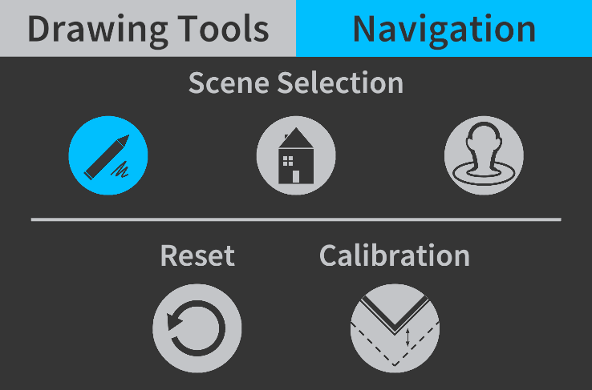
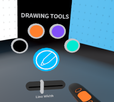

# Sample Demo App: Logitech VR Ink Experience

This application is meant as the first contact experience when using the Logitech VR Ink. It showcases several interactions that are unique to the stylus. It is a very good way to experiment and get familiar with the VR Ink experience.

## Install

1. Download the [latest version of the Logitech Demo Experience](https://github.com/Logitech/vr_ink_sdk/releases).
2. Unzip it on your drive.
3. Make sure SteamVR is running and VR Ink (and a controller) are paired and connected.
4. Run the LogitechDemoExperience.exe.

## Try it

For a full experience you will need to have a **desk with a flat area of 60x80cm (A1)** that is free of any objects and offers good gliding conditions (textured surfaces will impact the tracking performance).
Once you have that space, you'll need to calibrate it. Calibration will be stored so you don't have to do it again next time, though you can still run it again if needed.

### Navigating the demo

You can use the Navigation menu by selecting it with VR Ink on the desk menu:

The app will offer three different scenarios that can be accessed by using the Navigation menu, select:

-  to access the Drawing experience

-  to access the Markup experience

-  to access the Sculpting experience

### Calibrating the Space

On the Navigation Menu select  to go into calibration mode. Then click the VR Ink touchstrip while holding the VR Ink tip in each of the 3 corners of your desired space. This will align the virtual canvas with real 2D surface in front of you.

### Drawing Experience

Once the surface is calibrated, you can draw in 2D by pressing the tip of the stylus on the physical surface, or you can draw in the air by pressing the Primary Button. The harder you press the thicker the line will be.
The Brush Size Slider on the surface will change the maximum thickness of the line. You can also swipe up/down on the Touchpad to adjust the brush size.

### Markup Experience

In addition to being able to draw in the air and on the 2D surface, you can also draw on the 3D Model in this demo. The house can be dragged around by pressing the grip button on the stylus, and scaled and rotated by pressing the grip on the Vive controller as well.

You can create callouts by selecting the callout button on the surface UI and then by pressing on the Primary Button on VR Ink twice.

### Sculpting Experience

In this demo, you can move the vertices of the head model around using the Primary Button on the stylus. There are 3 modes available: adding, subtracting and blending. The harder you press, the bigger the effect on the mesh. You can also use the Grip Buttons on VR Ink to rotate the head.

### Marker Menu

The desk menu is great for a desk experience, but to access these menu options while standing you can use the Marker menu. Press and hold the Touchstrip to make the Marker menu appear in front of VR Ink. Select the option you want by pointing towards an icon and releasing the Touchstrip.

## Shortcuts

In addition to the Navigation menu, you can also use some keyboard shortcuts:

| Shortcut /Keyboard key           | Effect                                                                                                                                | NOTES                                             |
|----------------------------------|---------------------------------------------------------------------------------------------------------------------------------------|---------------------------------------------------|
| Shift + o                        | The environment will change to a calibration mode. Use the Analog Tip to point at the corners of the plinth and click the Touchstrip. |                                                   |
| 1                                | Switch to Drawing Experience.                                                                                                         |                                                   |
| 2                                | Switch to Markup Experience.                                                                                                          |                                                   |
| 3                                | Switch to Sculpting Experience.                                                                                                       |                                                   |
| 4                                | Swap controllers Handedness.                                                                                                          | Useful only if no Stylus detected by application. |
| Vive controller Trackpad Left    | Undo.                                                                                                                                 | 1 second press to clear everything.               |
| Vive controller Trackpad Right   | Redo.                                                                                                                                 |                                                   |
