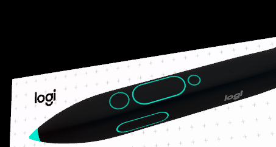
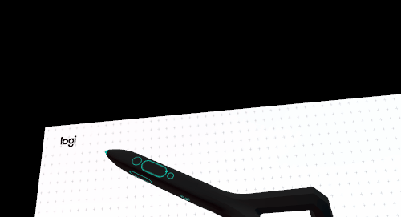
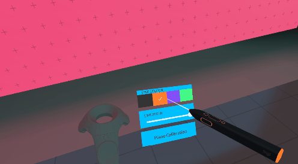

# Design Guidelines

There are some design considerations you should take into account when integrating VR Ink support. [Our Toolkit](../../Assets/Toolkit) goes more in depth regarding specific interactions using VR Ink, but here we will focus on the general design principles around VR Ink. Sections in these guidelines refer to the models provided in the SDK, but you may also apply them to your own models if you choose to not use one of the models provided.

## 3D Models

We provide two variations of VR Ink model in this SDK, one with tracking geometry on the back of the Stylus and one without. These models are split into parts to allow interactions and feedback to be built around each component of VR Ink. You can download them from the [latest release](https://github.com/Logitech/vr_ink_sdk/releases).

**We highly recommend using the simple model** without the tracking the geometry at the back.

## Visual Feedback

VR Ink has 6 inputs represented on its model: the Analog Tip, Primary Button, Grip Buttons, Touchstrip, Menu Button and the System Button. All of these inputs have accents except for the System Button. Additionally, the VR Ink simple model has an accented endcap at the back of the model. These accents can be used to represent the current state of VR Ink, such as the current active colour.

### Analog Tip

The default tip of VR Ink should show the current active colour, and remains a solid colour to clearly show it's ready to be used. If your application has multiple stylus based tools, it's possible to swap the tip model with other designs to represent these tools and interactions.

### Primary Button

You cannot show the button travel of the Primary Button as there is virtually none. Instead, we recommend that you use a gradual colour fill to represent the pressure applied on the button, from no pressure applied to max pressure. To make it clear when pressure is initially detected, the gradual colour fill should begin at some value larger than 0 in size; the start size should be visible from a little less than arms length (about 50 - 70cm away from the user).

### Grip Buttons

Both of the Grip Buttons should highlight when either one is pressed, since their inputs are on the same channel and are indistinguishable from each other. In most cases a colour fill on the buttons should be suitable to communicate the gripped state.

### Touchstrip

The Touchstrip handles 2 inputs that should be represented: the touch position and click state. The touch position should be represented by a single dot that appears when the touchstrip is touched. This will also help the user navigate to other inputs on the device. Like other digital inputs, a colour fill on the touchstrip represents when it is clicked.

## UI Interaction

There are a couple of things we have uncovered when working with VR Ink regarding UI based interactions. Keep this in mind when it comes to implementing UI in your VR experience.

### Selection Control

When selecting a UI element, it is recommended to have a **very low force activation threshold** on the Primary button. This is to make the whole interaction snappier and to make it easier for the user to interact with several UI elements.

### Haptics

Because the device doesn't have actual mechanical clicks, we recommend that you use **haptics as a way to reinforce validation.**

In the case of simple UI in VR:

- When pointing at a UI element, do not trigger a vibration every time you hover a new element, but rather leverage visual feedback to show the hover state (button raising, change of color, sprite swap, etc.)

- When clicking on the UI element, **trigger a small vibration**. This communicates to the user that the selection has been made. The user will relax their pressure on the Primary Button as soon as the vibration happens.

## Ergonomics and Interactions

When designing for Logitech VR Ink it is important to keep user immersion in mind. Any digital interactions need to strive to provide a sense of flow.

### Menu Button

The Menu Button should be used for legacy support or tertiary interactions. VR Ink is designed to support the Primary Button and Touchstrip comfortably with most grips, and the user may need to readjust their grip to use the Menu Button. To avoid readjusting your grip too often, only use the Menu Button for less common interactions.

If you have critical control on the dominant hand in your application, think about transferring some of that load to the non-dominant hand.
