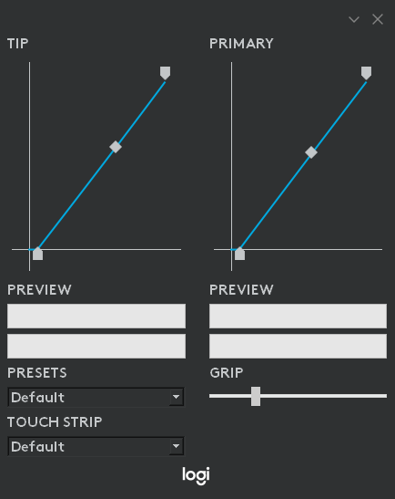

# Logitech VR Ink Driver

The driver will allow you to customize the VR Ink. You can define force response curves for the tip and primary button as well as the grip activation threshold. Ultimately the driver will be automatically downloaded when you first pair the stylus to your system.

## In Development

For early versions of VR Ink, we issue a driver that listens to the physical device and advertises a virtual device. Unlike the physical device, the virtual device registers as either the left or right hand and can be used by applications as if it were the real Stylus, with about ~10ms latency. In the near future, our device firmware will be ready to do most of the heavy lifting that is currently in the driver. When this happens, we will seamlessly switch back to using a single device. **If your app can use our virtual device now, it will be 100% compatible with the next generation.**

## Installation

Please check out our [guide on setting up the VR Ink](Assets) for instructions on installing the Driver. The driver files can be found in releases.

## Features

This is the driver UI:
 

 
You can change the response curve for both the tip and the primary button. If you are using a SteamVR version older than SteamVR 1.5.8, both of these will be linked; pressing on the tip or the primary button will activate the 2 preview sliders. If you are using SteamVR 1.5.8 or newer, both of these inputs will be separated.

The Driver UI should automatically close when you quit SteamVR, but if you want to manually close the driver UI you will have to go to the system tray, right click on the Logi icon and select 'Quit'.
