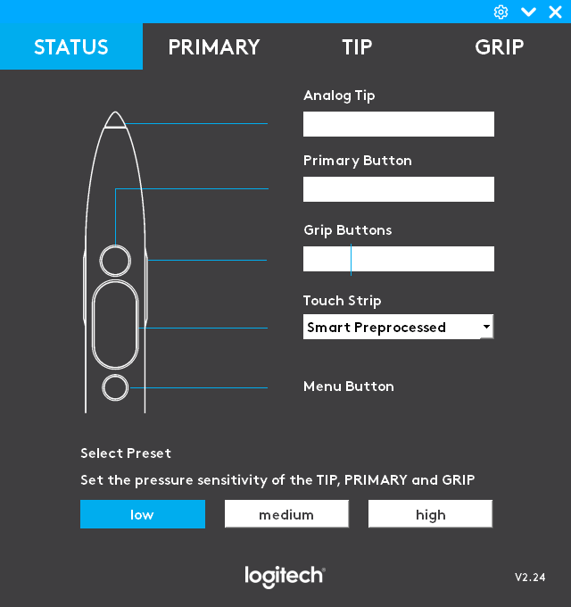

# Logitech VR Ink Driver

The Driver will allow you to customize VR Ink. You can define force response curves for the tip and primary button as well as the grip activation threshold.

## In Development

For early versions of VR Ink, we issue a driver that listens to the physical device and advertises a virtual device. Like a physical device, the virtual device registers as either the Left or Right hand in OpenVR. Because of this approach there is a delay of around 10ms on input and pose.

In the future the virtual device will disappear and the features exposed by the virtual device software will be managed directly into the device's firmware. **If your application can use our virtual device now, it will be 100% compatible with the future iterations of VR Ink.**

## Installation

Please check out our [guide on setting up VR Ink](../../Assets) for instructions on installing the Driver. The Driver files can be found on the [releases page](https://github.com/Logitech/vr_ink_sdk/releases).

## How to Use

The driver automatically turns on when starting SteamVR, and will shut down automatically when closing SteamVR.

### Status Page

The status page allows you to check if VR Ink is working as expected, the buttons should highlight on the device schematic and you will the progress bar for any analog input available on the device.

#### Touchstrip Settings

The radio menu for the Touchstrip gives you control on how to interpret the touch values coming out of the device. As such any other options than **Default** will introduce a small delay in detecting touch input.

| 
 Mode
 | Description |
|----|---------------|
| **Smart** | Reject touch input when the input has been detected on the Primary Button **BEFORE** the curve modifying the primary input have been applied|
| **Default** | Default values of the Touchstrip with no processing  |
| **Disabled** | The Touchstrip is disabled no touch event will go trough.|
| **Smart Preprocessed** | Reject touch input when the input has been detected on the Primary Button **AFTER** the curve modifying the primary input have been applied |

### Pressure Presets

On the STATUS page you can select 3 presets that will change the analog response of the different inputs on VR Ink.

We recommend that you start with the **low** preset; if you feel like it is too easy to activate certain inputs in a given application you can try to select **medium** or **high**.

If you want to have finer control one each of the analog input you can select the PRIMARY, TIP or GRIP tab. There you will be able to manually adjust the curves and thresholds as you see fit.

### Analytics

On the first launch you will asked about sharing anonymized analytics data:

We would appreciate if you would opt in, since this will help Logitech understand which features of VR Ink are the most used, and it will be helpful in case of remote support.

You can decide to opt in and out at any moment by clicking on the cogwheel at the top right of the application:

## Troubleshooting

If you experience any problem with your VR Ink device, have a look at the [FAQ section](./../FAQ/Readme.md).
If this does not solve your problem you can contact us at [vrinksupport@logitech.com](mailto:vrinksupport@logitech.com).
