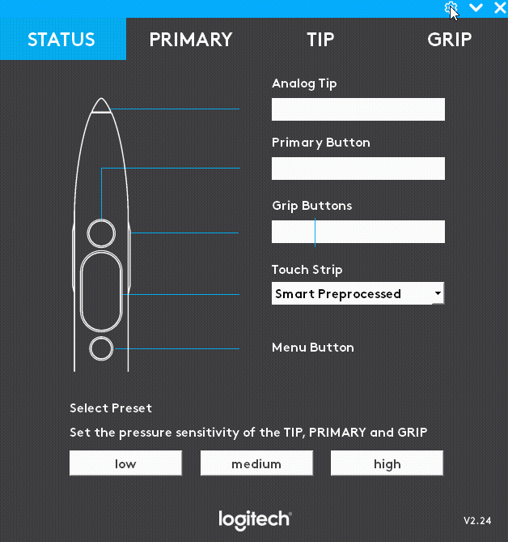
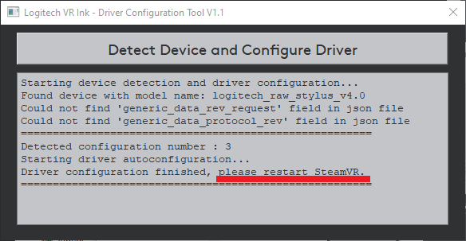
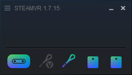

# Logitech VR Ink Driver

The Driver will allow you to customize VR Ink. You can define force response curves for the tip and primary button as well as the grip activation threshold.

## In Development

For early versions of VR Ink, we issue a driver that listens to the physical device and advertises a virtual device. Like a physical device, the virtual device registers as either the Left or Right hand in OpenVR. Because of this approach there is a delay of around 10ms on input and pose.

In the future the virtual device will disappear and the features exposed by the virtual device software will be managed directly into the device's firmware. **If your application can use our virtual device now, it will be 100% compatible with the future iterations of VR Ink.**

## Installation

Please check out our [guide on setting up VR Ink](../../Assets) for instructions on installing the Driver. The Driver files can be found on the [releases page](https://github.com/Logitech/vr_ink_sdk/releases).

## How to Use

The driver automatically turns on when starting SteamVR, and will shut down automatically when closing SteamVR.

### Status Page

The status page allows you to check if VR Ink is working as expected, the buttons should highlight on the device schematic and you will the progress bar for any analog input available on the device.

#### Touchstrip Settings

The radio menu for the Touchstrip gives you control on how to interpret the touch values coming out of the device. As such any other options than **Default** will introduce a small delay in detecting touch input.

| 
 Mode
 | Description |
|----|---------------|
| **Smart** | Reject touch input when the input has been detected on the Primary Button **BEFORE** the curve modifying the primary input have been applied|
| **Default** | Default values of the Touchstrip with no processing  |
| **Disabled** | The Touchstrip is disabled no touch event will go trough.|
| **Smart Preprocessed** | Reject touch input when the input has been detected on the Primary Button **AFTER** the curve modifying the primary input have been applied |

### Pressure Presets

By selecting the PRESSURE tab you can play with response of the different analog inputs on the device.

We recommend that you start with the **low** preset; if you feel like it is too easy to activate certain inputs in a given application you can try to select **medium** or **high**.

If you want to have finer control one each of the analog input you can *Customize* and the GRIP tab. There you will be able to manually adjust the curve and threshold as you see fit.

### Analytics

On the first launch you will asked about sharing anonymized analytics data:

We would appreciate if you would opt in, since this will help Logitech understand which features of VR Ink are the most used, and it will be helpful in case of remote support.

You can decide to opt in and out at any moment by going to the *Advanced* menu on the STATUS page.

## Troubleshooting

### 1. After installing the Driver and pairing my VR Ink, I can see the 3D model moving in the SteamVR shell. However, when pressing any button, nothing shows on the Status tab of the Driver UI.
This could happen if your device has a legacy configuration (you got one of the first VR Ink devices!). We provide a configuration tool that will automatically change the Driver settings to support all device versions.

How to use the configuration tool:
- Verify that the VR Ink 3D model is correctly tracked in the SteamVR VR view and that the Driver UI is running
- Go to the Driver installation files folder and run the `ConfigurationToolBatch.bat` file to launch the tool:

    

- Press the "Detect Device and Configure Driver" button

    

- The tool will let you know if your device had a supported configuration and will ask you to restart SteamVR to apply the changes. After restarting SteamVR you should be able to see the inputs working in the Status tab of the Driver UI.

    

- If the configuration tool was not able to detect your device or its configuration is not currently supported : please contact our technical support with a screenshot of the configuration tool and the serial number of your unit so we can investigate how to solve the issue.

### 2. The stylus doesn't show in the shell and I can't see input on the STATUS window

One of the biggest limitation of the driver is that input **does not work** when the SteamVR Dashboard is up. Button press will not go trough the STATUS window of the driver and the 3D model of VR Ink will disappear in the shell.

Your SteamVR status will show the virtual device as disconnected:

As a reference here is what the SteamVR Dashboard look like this:

Quitting the SteamVR Dashboard by **pressing the system button a paired controller other than VR Ink or by clicking the power button on the side of the HMD** will fix the issue.
