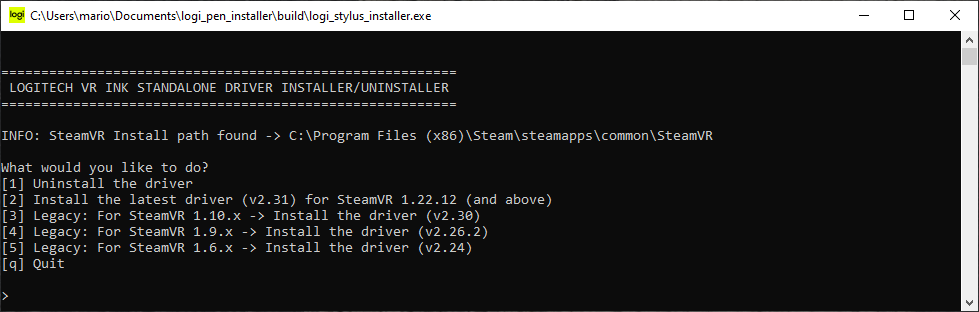
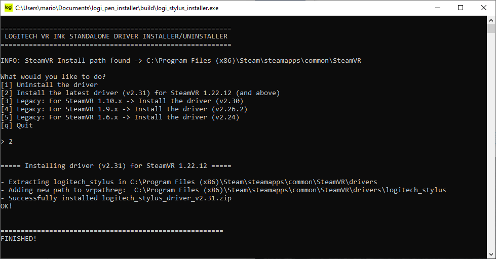
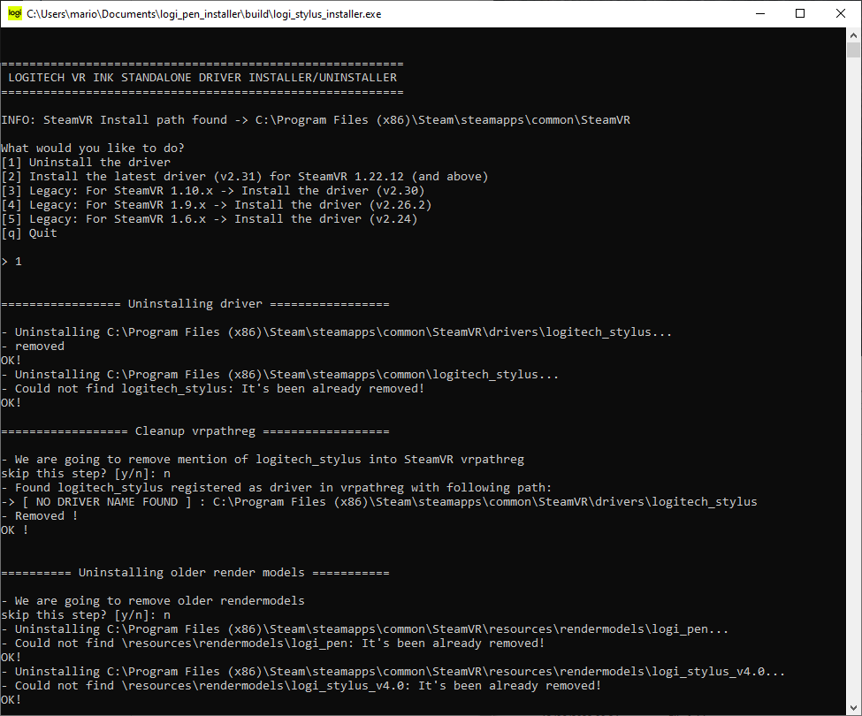

# VR Ink Driver Manual Installer 

**WARNING**:
> This manual installer/uninstaller is only intended to be used if you cannot use the steamStore or cannot download the installer from it.

If you are running a standalone version of SteamVR then you must install the driver manually using our installer/uninstaller.

 

## Supported versions

Here is the list of supported versions for the manual installer:

|SteamVR version| Driver version| Note |
|---|---|---|
|**1.6.x**|v 2.24|
|**1.9.x**|v 2.26.2|
|**1.10.x**|v 2.30| latest

 

## Features
The Installer/Uninstaller is able to:
- install the selected driver version in `SteamVR/drivers/logitech_stylus`*.
- register the `SteamVR/drivers/logitech_stylus` path into vrpathreg.
- remove any previous installation of `logitech_stylus` in either the `SteamVR/drivers/` or `Steam/steamapps/common/` folders.
- remove ANY path that mentions `logitech_stylus`in vrpathreg.

> note* : this is a safe folder for installing drivers on a standalone SteamVR install.

 

## Instructions

- go to the [releases page](https://github.com/Logitech/vr_ink_sdk/releases) and fetch the manual installer/uninstaller zip file.
- unzip it to a location of your choice.
- run the `vrink_manual_installer.exe`   

- RECOMMENDED: if you think you've installed a previous version of our driver, it's better to start by **uninstalling** it first, by choosing option `1`
- then select your option `2,3,4`, depending on the SteamVR version that you have.
- Follow the instructions on the console.
- in case you are asked a question, you can either choose `y` or `yes` to agree or simply **hit ENTER (or any key) to proceed**.

 

## Examples

Here is an example of an install:

Here is the example of an uninstall:

 

## Troubleshooting

If you experience any problem with your VR Ink device, have a look at the [FAQ section](./../FAQ/Readme.md).
If this does not solve your problem you can contact us at [vrinksupport@logitech.com](mailto:vrinksupport@logitech.com).
