## Troubleshooting

## 1. How can I pair VR Ink to my system?

You can pair it like any other vr controller:
- Turn off the right (or left if you're a leftie!) Vive controller (or Index controller).
- Turn on your VR Ink (long press the System button).
- Long press both the System and menu buttons on the VR Ink until the LED blinks blue.
- Use the SteamVR dashboard and select **pair controller** and wait until the LED turns green.

Detailed instructions can be found [here](./../../Assets#2-pairing-vr-ink).

## 2. What is the best Lighthouse configuration?

The VR Ink can be used in these configurations:
- 4x lighthouse 2.0 configuration **recommended**
- 1-2x lighthouse 2.0 can also work, but the coverage will be reduced.
- 1-2x ealier generation lighthouses (1.0) is supported, but with reduced performance.

## 3. What is the recommended SteamVR version?

VR Ink works at its best with **SteamVR 1.9.x** and on. Some initial support is already available starting from **SteamVR 1.4.18**.

## 4. SteamVR is in safe mode and my VR Ink does not work, why?

When SteamVR is in safe mode **it disables all additional drivers**, including the one that manages VR Ink. Restart SteamVR and make sure it is not in "safe mode" to use VR Ink.

## 5. Can I use 2 VR Inks at the same time?

Currently it is not possible to use two VR Inks at the same time.

## 6. I have no input after pairing a second VR Ink on my system.

Limitations in our driver prevent us to have a multiple VR Ink devices recognized during the same session of SteamVR. As a rule of thumb, **every time you pair a new VR Ink to a system, restart SteamVR**.

For instance in this case, my first VR Ink ran out of battery, I decided to pair a second VR Ink and my SteamVR status window looks like the this:
 
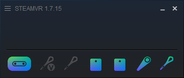

You notice that the Virtual Device icon stays greyed out, to get it work again you need to restart steamVR.

It now looks like this and all inputs are working:
 
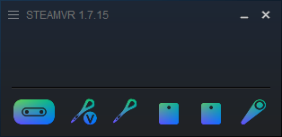

## 7. The stylus doesn't appear in the SteamVR shell and I can't see input on the status tab in the driver window.

One of the current biggest limitations of the driver is that input **does not work** when the SteamVR Dashboard is open. Button presses will not go trough the status window of the driver and the 3D model of VR Ink will disappear in the SteamVR shell.

Your SteamVR status window will show the virtual device as disconnected:
 

As a reference, here is what the SteamVR Dashboard looks like:
 
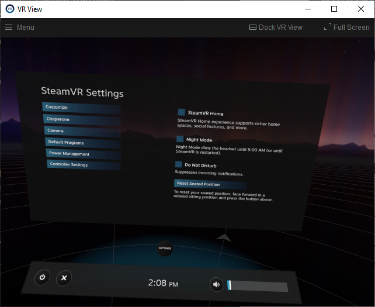

Quitting the SteamVR Dashboard by **pressing the system button on a paired controller other than VR Ink or by clicking the power button on the side of the HMD** will fix the issue.

## 8. After installing the Driver and pairing my VR Ink, I can see the 3D model moving in the SteamVR shell. However, when pressing any buttons, nothing shows on the status tab in the driver window.

This could happen if your device has a legacy configuration (you got one of the first VR Ink devices!). We provide a configuration tool that will automatically change the Driver settings to support all device versions.

How to use the configuration tool:
- Verify that the VR Ink 3D model is correctly tracked in the SteamVR view and that the Driver UI is running.
- Go to the Driver installation files folder and run the `ConfigurationToolBatch.bat` file to launch the tool:
     
    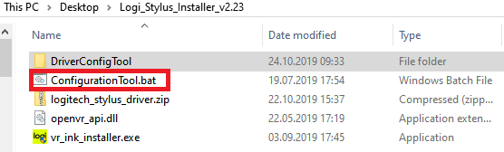

- Press the "Detect Device and Configure Driver" button.
     
    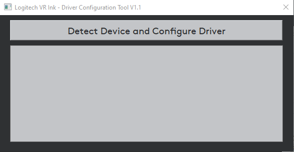

- The tool will let you know if your device had a supported configuration and will ask you to restart SteamVR to apply the changes. After restarting SteamVR, you should be able to see the inputs working in the Status tab of the Driver window.
     
    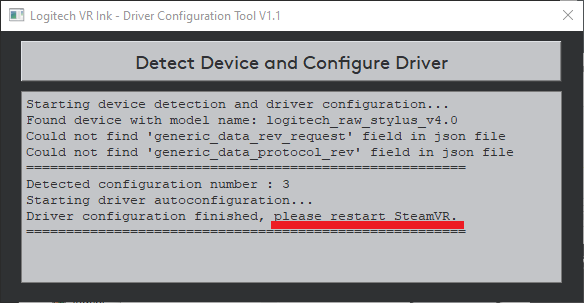

- If the configuration tool was not able to detect your device or its configuration is not currently supported, please contact our technical support with a screenshot of the configuration tool and the serial number of your unit so we can investigate how to resolve the issue.

## 9. I cannot use a Vive tracker as an external camera for mixed reality capture.

The following procedure is only valid if the application has implemented SteamVR mixed reality mode. More details [here](https://vr.arvilab.com/blog/capturing-mixed-reality-video-unity-and-steamvr).

Let's look at how to setup VR Ink to capture mixed reality content for Tilt Brush.

The Mixed Reality capture in SteamVR seems to always select the 3rd tracked device connected. The work around consists of turning on the devices in the correct sequence in order to have the tracker detected as the 3rd device.

### Pairing the Vive tracker to its dongle.

If your Vive tracker is already paired to a dongle please skip to the next section.

With the VR Ink and Vive Controller configuration, follow this procedure:

1. All devices should be turned off; Vive Controllers, Tracker and VR Ink.
2. Plug the dongle into the computer.
3. Turn on SteamVR, you should see this.
    
   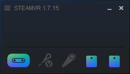

4. Turn on VR Ink and a Vive Controller.
    
   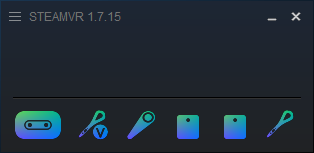

5. Select *Pair Controller* by right-clicking on an inactive controller, then select *I want to pair a different type of controller*, select Vive Tracker.
    
   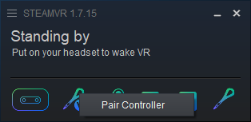
    
   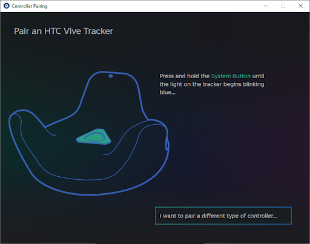

6. Put the Vive tracker in pairing mode by pressing the System button.
7. You should now see this:
    
   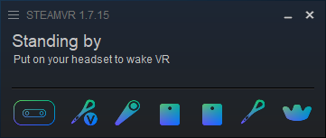
    
   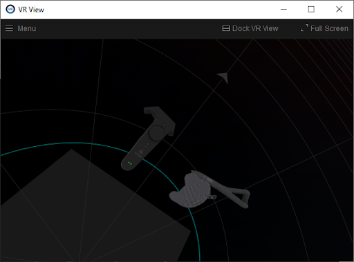

The tracker is now paired to its dongle!

#### Setting up the mixed reality capture.

You should have a Vive tracker paired to its dongle and the dongle plugged into the PC for next part.

This part assumes that you have put the externalcamera.cfg in Tilt Brush folder already.

1. All devices should be turned off; Vive Controllers, Tracker and VR Ink
2. Turn on SteamVR, you should see this.
    
   

3. Turn on the previously paired Vive controller first.
    
   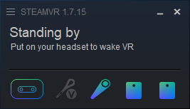

4. Turn on the tracker.
    
   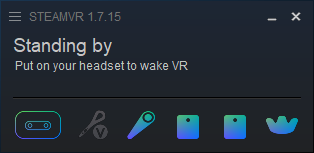

5. Right click on the tracker, select Manage Tracker and make sure it is set as *Camera*.
    
   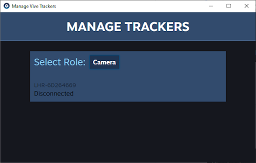

6. Turn on VR Ink.
    
   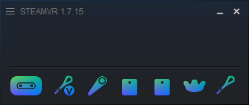

7. Now start TiltBrush.
    
   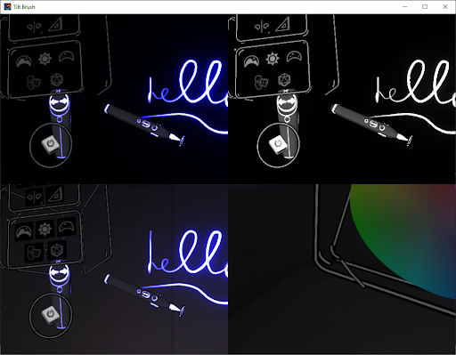

The Vive tracker should move the camera in the bottom left quadrant. The setup for mixed reality capture is now finished!
