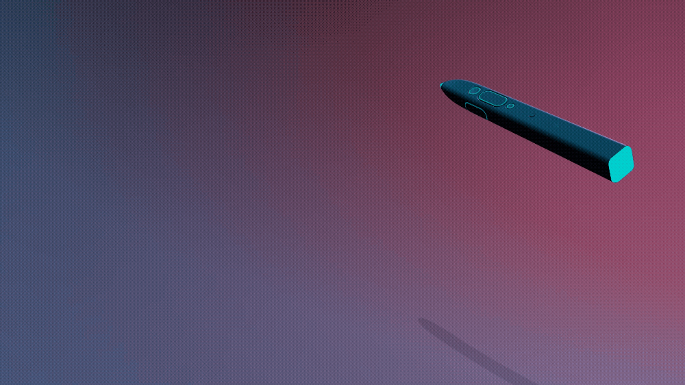
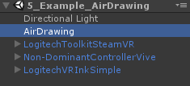
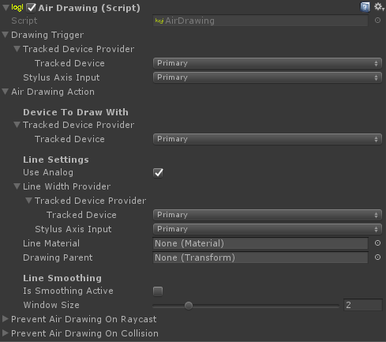
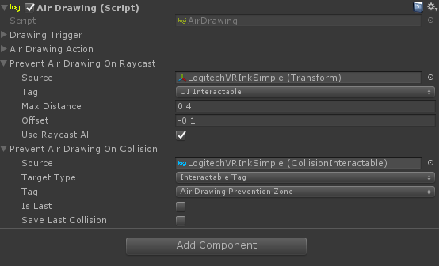
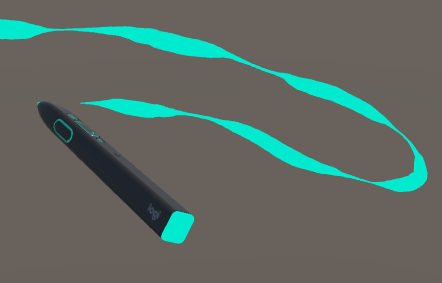
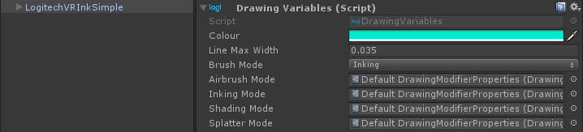
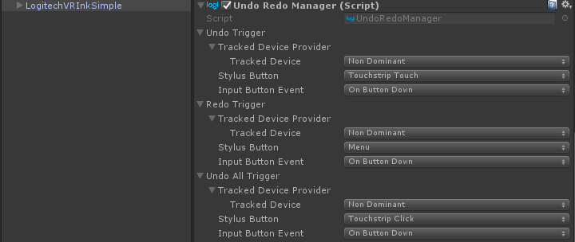

# Air Drawing



## Interactions

There are 2 interactions that are relevant to drawing in the air:

* **Air Drawing** - Inking in 3D.
* **Undo/Redo** - Undo or redo a line that has been drawn.

An implementation of these 2 interactions can be found in the  scene `5_Example_AirDrawing`. The Air Drawing interaction can be found in the `AirDrawing` GameObject whilst the Undo/Redo manager is found in the `LogitechVRInkSimple` prefab.



## Implementation

The `AirDrawing.cs` script is a classic Toolkit interaction. It uses the Trigger, `DrawingTrigger`, which is an `InputTrigger` allowing us to get input from a tracked device. The `AirDrawingAction` is in charge of creating the line.
<br>


In `Air Drawing Action`, you can set the device to draw with, as well as change various other line settings. `Use Analog` controls whether the line will be a fixed width or vary with a provided axis value. We get that value from Line Width Provider, which gets an axis value from a tracked device.

You can also define the Line Material along with the GameObject that the lines will parent to.

### Line Smoothing

By default the drawing will use the raw tracked device position, resulting in a line without filtering. We found that smoothing the line created a better representation of the intent of the user. As such we provide a smoothing algorithm that you can activate in the Line Settings. We compute the average of the last X point, where X is the `Window Size` defined in the Line Settings, and apply this new average position to the last drawn point.

### Air Drawing Prevention

There is some cases where you may not want to draw. For example, when interacting with UI. We have implemented two ways to contextually prevent drawing.

* Prevent Air Drawing on Raycast
  * In this case we use a `RaycastTrigger`. If you are pointing at an `Interactable` that has a specified tag you cannot draw. For example, when the user is pointing at a UI element, you should not be able to draw but instead select the UI
* Prevent Air Drawing on Collision
  * We use a `CollisionTrigger` for this case. This allows you to define zones using `CollisionInteractables` where you do not want to activate air drawing.



### Lines

To create a line, the `AirDrawingAction` in the Air Drawing interaction will create a new GameObject with a `LineRenderer` component. If you are using the default settings in the example, the `LineRenderer` point follows the tracked device position and the width of the line is determined by the pressure you are applying on the primary button of VR Ink. Every stroke will create a new GameObject.
<br>


You may also set Air Drawing to use a fixed width when drawing by changing the Line Settings.

We found that the Unity Line Renderer comes with some limitations. For instance when drawing slowly, the Line Renderer component can create points that are too close to each other and it may draw the line facing in the wrong direction, appearing invisible to the user.

To avoid this issue, we defined a minimum distance at which a new point can be created.

```csharp
private void AddPoint(LineRenderer line, WidthCurve curve, Vector3 newPosition, float width)
{
    float distance = Vector3.Distance(_lastPosition, newPosition);
    if (distance < MinimalDrawingDistance && curve.Distances.Count > 0)
    {
        line.widthCurve = curve.GetCurve();
        line.SetPosition(line.positionCount - 1, line.transform.InverseTransformPoint(newPosition));
        return;
    }
    _lastPosition = newPosition;
    curve.AddPoint(width, distance);
    line.widthCurve = curve.GetCurve();
    line.positionCount++;
    line.SetPosition(line.positionCount - 1, line.transform.InverseTransformPoint(newPosition));
}
```

<br>

## Brush Modes

For the `AirDrawing` Interaction to function, we need the script component `DrawingVariables.cs` placed somewhere in the scene. By default it's attached to the `LogitechVRInkSimple` prefab. In this example the different brush modes use the same `DrawingModifierProperties` ScriptableObject asset, but if required, it allows for the addition of other brush modes with the creation of new `DrawingModifierProperties` assets.

`DrawingVariables` also holds the current brush size and brush colour. Changing the colour here will impact the drawing colour of VR Ink, as well as any colour based visual feedback on VR Ink. You can see this in action in our [Demo Experience](../DemoExperience/Readme.md) or the `1_Example_All_In_One` scene in the Toolkit.
<br>


## Undo/Redo

Each script that wants to implement Undo/Redo must use the IUndoRedo interface. The Undo/Redo works as a stack of actions. 

Trigger an Undo and you will call the implemented `Undo()` method for the last action on the stack. For a drawn line created with the `AirDrawingAction`, `UndoRedoGameobject` handles the Undo/Redo functionality and will call `SetActive(false)` on its GameObject. Trigger an undo again and you will continue to go down the stack. Trigger a Redo, and you will go up once on stack and call the implemented `Redo()` method for the given action on the stack.

```csharp
public class UndoRedoGameObject : MonoBehaviour, IUndoRedo
{
	public void Clear()
	{
		Destroy(this.gameObject);
	}

	public void Redo()
	{
		gameObject.SetActive(true);
	}

	public void Undo()
	{
		gameObject.SetActive(false);
	}

	void Start()
	{
		UndoRedoManager.Instance.RegisterNewAction(this);
	}
}
```

The `LogitechVRInkSimple` prefab comes with the `UndoRedoManager` component that allows you to define buttons to trigger undo and redo. By default we use buttons from the non-dominant hand controller.
<br>

