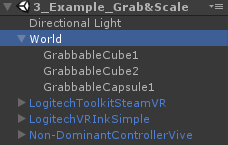
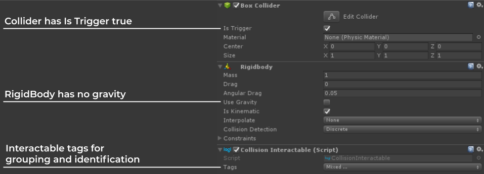
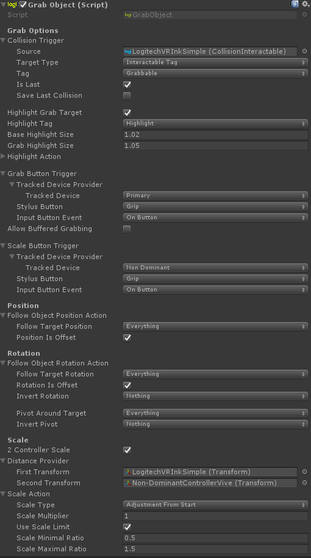
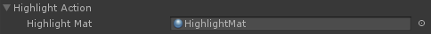
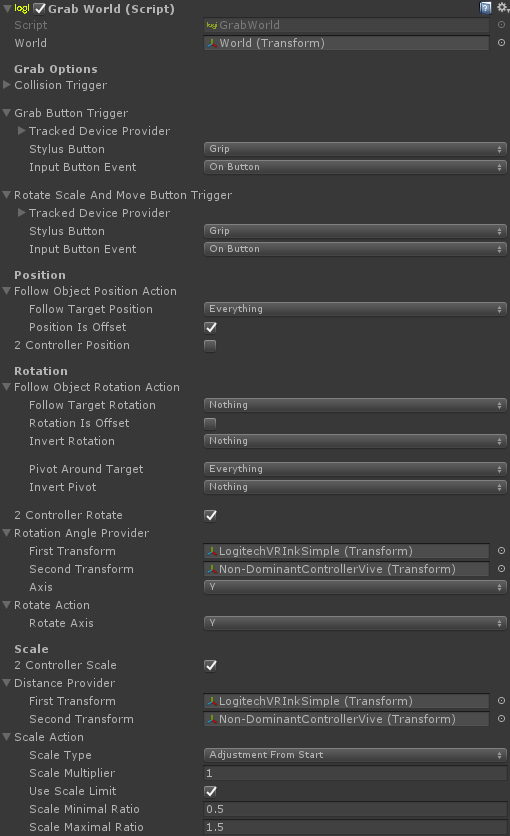
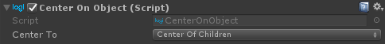

# Grab & Scale

The Grab & Scale module provides a way to experiment with different grab and scaling techniques. You can either grab each object individually or the whole world at once.

## Interactions
There are two different interactions for object manipulation in the Toolkit:

* Grab Object: Interact with one specific object.
* Grab World: Interact with a set of objects at once.

The implementation of each of these interactions can be found in the example scene `3_Example_Grab&Scale` in the `World` GameObject.
 

## Implementation

### Setting up Objects to be Manipulated
All the grabbable such as `GrabbableCube1` are connected to a Collider, a RigidBody and a `CollisionInteractable`. `CollisionInteractable` will handle all the collision events in the conext of the Toolkit. Ensure that in the collider, `IsTrigger` is set to true!
 

The `CollisionInteractable` tags are usually set to `Grabbable` and `Highlight`. This means that these GameObjects can be grabbed and will have a highlight when collided with or grabbed.

To Grab objects using the VR Ink, ensure that the model has the `CollisionInteractable` script attached along with a Collider and a Rigidboy as well. This should be setup by default in the `LogitechVRInk` prefabs.

### Grab Object
To allow a GameObject with the designated Interactable Tag to be grabbable and scalable, we need to use the `GrabObject` script. You can attach that script to any active GameObject in the hierarchy with a Collider and a RigidBody.
 

The `CollisionTrigger` determines which GameObjects we can grab.

The highlighting is handled through the `HighlightAction`.
 

If the target has the `Highlight` tag, there will be visual feedback when the target is collided or grabbed.
 

We also use an `InputTrigger` designated here as the Grab Button Trigger to enable the grab & scale. Once an object is grabbed, there are several possible actions you can apply to it. With a single controller you can translate and rotate it. By using a second controller, you can also scale the grabbed GameObject.

### Grab World
To allow a set of GameObjects to be manipulated simultaneously, we need to use the `GrabWorld` script. It can be attached to any active GameObject in the scene.
 

`GrabWorld` works basically the same way as the `GrabObject` with the two main following differences:

1.  You can grab the world object from anywhere in the world. You don't need to directly collide with the GameObject.
2.  You can do the translations and rotations with one or two controllers.

Note that when you grab a GameObject and rotate it, it will rotate itself and all it's children around its own center. Depending on the positional offset of the children compared to the parent, you may not get the result you are looking for. In order to control the center of rotation, we add the script `CenterOnObject.cs` to the parent GameObject. This gives us a way to change the position of the parent without changing the world position of the children to give us more control of the rotation.
 
