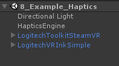
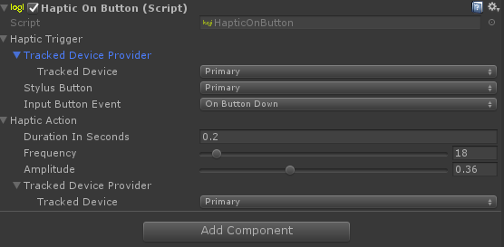
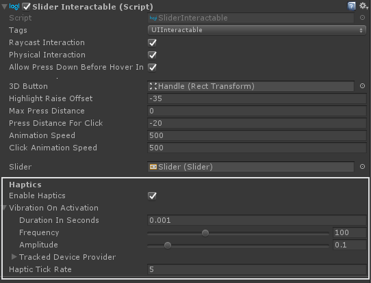

# Haptics

![Banner Image of haptics]

The Logitech VR Ink is capable of providing high fidelity haptic feedback using its haptic engine.
The haptic engine is compatible with the existing feedback designed for the HTC Vive Controller, and in addition it is possible to create custom feedback using the toolkit.
In our example we allow you to map a haptic pulse to a button pressed on the VR Ink.

## Implementation

This is an example implementation that allow you to simply trigger an haptic pulse on a button event. Ultimately you need to implement the `HapticAction` at the relevant places. For instance the Toolkit also implements the `HapticAction` on the `UIInteractable` components and in the `SnapInteraction`.

### Example Scene

In this scene we have decided to implement a simple Interaction that make use of the `HapticAction.cs` script. This action can be implemented anywhere else in the code where you want a haptic event to trigger. We will see in the following section how to implement an haptic action to create a ratchet feeling when interacting with a slider.

You can find and implementation of the haptics in the scene `8_Example_Haptics`.



The haptic interaction, `HapticOnButton.cs`, is very simple and was  made using only a trigger and an action.



In this case when pressing play in this scene if you were to press the Primary button of the Primary hand you would trigger a haptic pulse with the designated amplitude, frequency and duration on the primary tracked device.

### Haptic Action in the field

Let's have a look at the implementation of the haptic action in the case of a slider. This is an interesting one as you need to repeat the haptic pulse several time during the interaction to create a feeling of ratcheting.



In scene `4_Example_MenuInteracitons` you can play around with the slider and see that haptics is periodically triggered as you change the value of the slider.

Let's have a look at the code:

```csharp

//Dedicated inspector block to haptics
[Header("Haptics"), SerializeField]
private bool _enableHaptics = true;
[SerializeField, ShowIf("_enableHaptics")]
private HapticAction _vibrationOnActivation;
[Tooltip("The rate at which haptic ticks will occur, from every 0% - every 100%.")]
[SerializeField, Range(0, 100), ShowIf("_enableHaptics")]
private float _hapticTickRate;

```

Now when interacting you want to trigger a haptic pulse when you first enter in contact with slider either by touching the element or interacting with it at distance. In that case you can trigger the haptics once:

```csharp
//register the TriggerOnce() for when the user physically interact with UI
private void Awake()
{
    UIElement = _slider;
    OnPhysicalPressDown += () => _vibrationOnActivation.TriggerOnce();
}

//Override the OnButtonDownEvent call TriggerOnce() for the haptic action
protected override void OnButtonDownEvent()
{
    if (_enableHaptics)
    {
        if (_firstPress)
        {
            SetCurrentHapticTick();
            _firstPress = false;
        }
        _vibrationOnActivation.TriggerOnce();
    }
}
```

Now the haptic event can trigger when selecting the slider, but we need to implement that ratchet feeling. That is where the `_hapticTickRate` parameter come into play. In our example the tick rate is set to 5, which means that every 5% of the slider value we will trigger a haptic pulse. Checkout out the `SetCurrentHapticTick` method to see how we dynamically set threshold that lets us trigger the haptic pulse at the right moment.

```csharp
 private void SliderMove(Vector2 hitCoord)
{
    // Adjust received coordinate to slider direction.
    float normValue;
    switch (_slider.direction)
    {
        case Slider.Direction.BottomToTop:
            normValue = hitCoord.y;
            break;
        case Slider.Direction.LeftToRight:
            normValue = hitCoord.x;
            break;
        case Slider.Direction.RightToLeft:
            normValue = 1f - hitCoord.x;
            break;
        case Slider.Direction.TopToBottom:
            normValue = 1f - hitCoord.y;
            break;
        default:
            return;
    }

    // Update the slider value.
    _slider.value = _slider.minValue + normValue * (_slider.maxValue - _slider.minValue);

    if (_enableHaptics)
    {
        if (_slider.value >= _maxTickValue || _slider.value <= _minTickValue)
        {
            SetCurrentHapticTick();
            _vibrationOnActivation.TriggerOnce();
        }
    }
}
```
