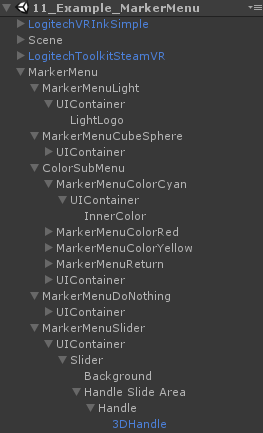
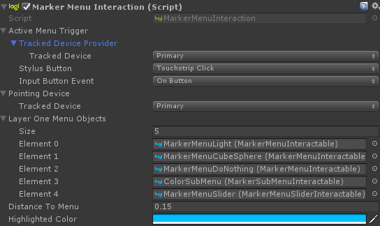
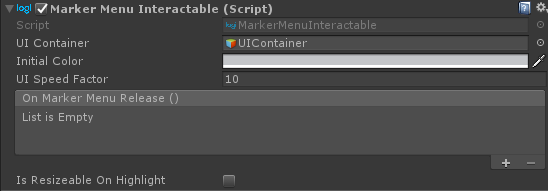
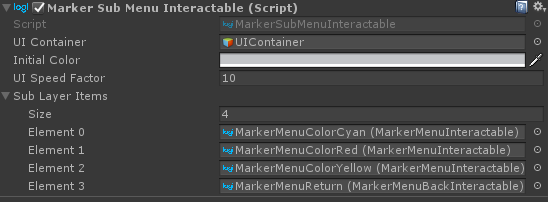

# Radial (Marker) Menu

Radial/Marker menus are widely used in touch and stylus-based interfaces. In the context of a VR stylus, they can be used for easy and efficient access to contextual menus. These menus can be faster to access than traditional list-based approaches. Also, users get faster with radial menus over time, because they take advantage of muscle memory and are essentially gesture-based.

The Marker Menu Interaction module provides an example of this interaction. Rather than pointing directly at a UI element the Marker menu detects user intent by selecting the closest element you are pointing towards. The other difference with the UI Interaction block is that on the Marker Menu, validation happens when releasing the chosen input: the highlighted element will be picked.

The Marker Menu could also be context aware - showing different options depending on what the pointer was looking at when the menu was requested.

## UI Elements
There are 4 different kinds of contextual menus in the Toolkit.
*  Marker Menu Interactable
*  Marker Menu Slider Interactable
*  Marker Sub Menu Interactable
*  Marker Menu Back Interactable

The implementation of each Toolkit contextual menu can be found in the example scene `11_Example_MarkerMenu` in the `MarkerMenuInteraction` GameObject.
 

## Implementation
All marker menu items, such as `MarkerMenuSliderInteractable`, inherit from the abstract class script called `MarkerMenuItem`. All the marker menu items are handled by the `MarkerMenuInteraction` script, which takes a list of `MarkerMenuItem` as the 1st layer of interactable marker menu items.

More information can be found for most fields by hovering over them in the inspector.
 

### Marker Menu Item Selection
To decide which Marker menu item to select, the `MarkerMenuInteraction` script will create a virtual 2D plane perpendicular to the forward vector of the chosen controller. The script then highlights the closest Marker menu item to the raycast hit point on the 2D plane.

### Input
To get inputs from the Marker Menu items, the easiest way is to use the `OnMarkerMenuRelease()` Unity Event from the Unity UI component attached. This Unity Event will trigger when a `MarkerMenuInteractable` or `MarkerMenuSliderInteractable` is selected and the assigned stylus button is released. 

## Marker Menu Items
All marker menu items have the 3 following common fields in the inspector:
*  GameObject - `UI Container`
   * This GameObject represents the visible part of the marker menu. This part will move when the menu opens and change color when pointed at. *Note* that it's important for the `UI Container` to be another GameObject: it allows the user to select an option in the menu before the UI animation is finished! 
*  Color - `Initial Color`
    * This is the default color of the `UI Container` GameObject while this menu item is not selected. It's replaced by the `HighlightedColor` from the `MarkerMenuInteraction` when selected. 
*  float - `UI Speed Factor`
    * The `UI Speed Factor` determines how fast the `UI Container` GameObject will move from the center of the menu to its final position.

### Marker Sub Menu Interactable
A `MarkerSubMenuInteractable` will not trigger the `OnMarkerMenuRelease()` if selected and released. Instead it will display a new layer of marker menu items, defined by its own list. While the new layer is displayed, the previous one will disappear. Note that it's a good idea to put a `MarkerMenuBackInteractable` in any sub layer to give you the possibility to go back to a previous layer. 

