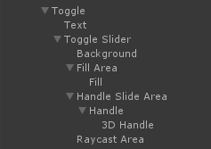
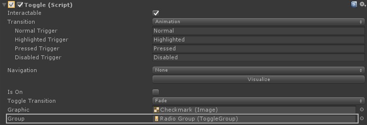

# Menu Interaction


The Menu Interaction module provides a way to interact with 3D, diegetic UI. Each UI element can be interacted through raycasting with controller button input or through physical interaction by pushing the UI element.

## UI Elements
There are currently 6 different kinds of UI elements in the Toolkit.
*  Button
*  Slider
*  Toggle
*  Checkbox
*  Radio Button
*  Control Point*

The implementation of each Toolkit UI element can be found in the example scene `4_Example_MenuInteractions` in the `Non-DominantControllerVive` GameObject.


\*Control Point is currently lacking an implementation in the example scene.

## Implementation
All of the Toolkit UI elements, such as `ButtonInteractable`, inherit from a script called `UIInteractable`, which inherits from `Interactable`. This just means that the settings for each UI element is held in these scripts and will be similar between all of them. `UIInteractable` will also handle the UI states and input.

More info can be found for most fields by hovering over them in the inspector.
<br>


Note that each of the existing Toolkit UI elements is connected to a collider and Unity UI component.
<br>


### Animation
Animations are generally* handled through both the Unity UI component's Transition field and the `UIInteractable` 3D button and related fields. Each UI element has a animator attached which, for example, uses the Unity Button Animation Transitions `Normal`, `Highlighted`, `Pressed` and `Disabled` to set the colour of the 3D Button. The `UIInteractable` fields can be used to handle how far the 3D Button raises when hovered along with the max distance it can be pushed, its press distance threshold to issue a click event and the animation speeds (return to resting position speed and raycast click animation speed).

\*Some UI elements have custom animation states, such as the [checkbox](#checkbox) or [radio button](#radio-button), which have additional animation states handled through other components.

### Input
To get inputs from the UI elements, the easiest way is to use the `OnClick()` or `OnValueChanged()` Unity Event from the Unity UI component attached. An optional haptic pulse for triggering a button can also be configured.

If you need more granular input from the UI, some extra Unity Events are exposed in the inspector of each `UIInteractable`.
<br>


Public events and states are also provided in code to hook into. The following events occur once when a condition is met, while the corresponding boolean states will be a constant on/off state. They can be subscribed to from any `UIInteractable`:
*  **UI Interaction** - Triggers with either physical interaction or raycast interaction.
    *  Event: OnPressDown;
    *  Bool:  OnPress
    *  Event: OnPressUp;
*  **Physical Interaction** - Triggers when the UI is physically pushed.
    *  Event: OnPhysicalPressDown;
    *  Bool:  OnPhysicalPress
    *  Event: OnPhysicalPressUp;
*  **Raycast Interaction** - Triggers when the UI is raycasted and the specified controller button is pressed.
    *  Event: OnControllerButtonDown;
    *  Bool:  OnControllerButton
    *  Event: OnControllerButtonUp;
*  **Raycast Hover** - Triggers when the UI is raycasted.
    *  Event: OnHoverIn;
    *  Bool:  OnHover
    *  Event: OnHoverOut;

```csharp
// Example.
public UIInteractable ExampleUIInteractable;

private void Start()
{
    ExampleUIInteractable.OnButtonDown += ExampleMethod;
    ExampleUIInteractable.OnPhysicalPressDown += ExampleMethod;
}

public void ExampleMethod()
{
    // Method implementation.
}
```

### Custom UI Elements
You can create your own custom UI component by creating a script that inherits from `UIInteractable`. Here, you can override the following methods:
*  void OnHoverInEvent(bool pressed)
*  void OnHoverEvent(RaycastHit hit, Transform raycastOrigin, bool isColliding)
*  void OnHoverOutEvent()
*  void OnButtonDownEvent()
*  void OnButtonEvent(RaycastHit hit)
*  void OnButtonUpEvent()

These methods are very similar to some of the public events and booleans mentioned earlier, but some provide extra information such as the the RaycastHit information if needed. We recommend checking out the implementation of each UI element to see how they're used.

## Raycast Clicker
To interact with our UI elements, we need to use the `RaycastClicker` script. It should be attached to the GameObject used to interact with the UI. By default, the LogitechVRInk prefab has one already attached.
<br>


Tracked Device is the device used for input, and Stylus Button is the button used for input. By default, the Tracked Device is the primary device (VR Ink if connected) and the Stylus Button is the primary button.

The Raycast Trigger handles raycast and controller button input for the UI elements. We can set it to only affect elements with a certain tag; by default it is the generic tag "UI Interactable". Max distance is the furthest distance you expect a user to easily interact with your UI. Since the origin of our VR Ink model is at the tip, we offset the raycast a little on the transform's forward axis for better results. Finally, Raycast All will prevent the raycast from getting blocked by other colliders.

The Raycast Collision Trigger is largely the same as the Raycast Trigger and handles physically pushing UI elements. The collision point (Max Distance) is set to be slightly after the tip for the best results.

Block Raycast Triggers is a list of `PropertyStateTriggers`. These can be assigned any other component and will return the state of a chosen public boolean of that component. If that state is true, it will prevent `RaycastClicker` from interacting with any UI elements. For example, we could prevent any unwanted button presses while drawing in the air by using the `CanDraw` field of the `AirDrawing` component.

## Surface Snapping

To give each UI element some physicality, we can utilize the `Snap Interaction` component that is in the VR Ink prefabs by default. The Snap Interaction is further explained in [Surface Drawing](./SurfaceDrawing). For the context of these UI element examples, the main thing to note is that the UI elements have a plane behind them that has a Box Collider and an `Interactable` component with the `Snappable` tag.

## Button
A button uses `ButtonInteractable` and is attached to a Unity Button component.
<br>


### Hierarchy


### Inspector


## Slider
A slider uses `SliderInteractable` and is attached to a Unity Slider component.
<br>


### Hierarchy
This component behaves a little differently from the rest. Instead of placing it beside a collider _and_ a Unity Slider, it should be a child of the Unity Slider transform, beside a mesh collider. This will provide the bounds for setting the slider position. In the hierarchy below, the `SliderInteractable` is placed in `RaycastArea`.
<br>


### Inspector


## Toggle
A toggle, like a slider, uses `SliderInteractable` and is attached to a Unity Slider component.
<br>


### Hierarchy
In the hierarchy below, the `SliderInteractable` is placed in `RaycastArea`.
<br>


### Inspector
To make the `SliderInteractable` act like a toggle, in the Unity Slider component set the Min value to 0, the Max value to 1 and the Whole Numbers boolean to true.
<br>


## Checkbox
A checkbox uses `ToggleInteractable` and is attached to a Unity Toggle component.
<br>


### Hierarchy


### Inspector
`OnValueChanged()` uses a [UIHelper script](#ui-helpers) to set the visual `IsOn` state in an attached animator.
<br>


## Radio Button
A Radio button, like a checkbox, uses `ToggleInteractable` and is attached to a Unity Toggle component.
<br>


### Hierarchy


### Inspector
What makes radio buttons different from checkboxes is that they use the Unity ToggleGroup component. Just assign a set of checkboxes to the same ToggleGroup.
<br>

<br>


## Control Point
The control point interactable doesn't use any Unity UI and is a new, completely custom input. It may be used to move a point around on a 2D plane, such as controlling a node on an animation curve.

## UI Helpers
There are various scripts found under `Scripts/Components/UIHelpers` that can be used in conjunction with the Unity `OnClick()` and `OnValueChanged()` events. They are generally very small and prescribed, usually used to toggle or set a value, or to ensure button animations work correctly.