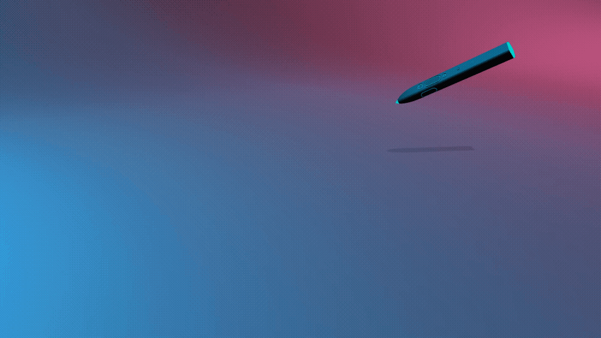
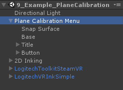
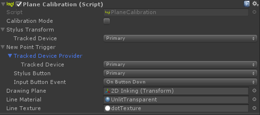
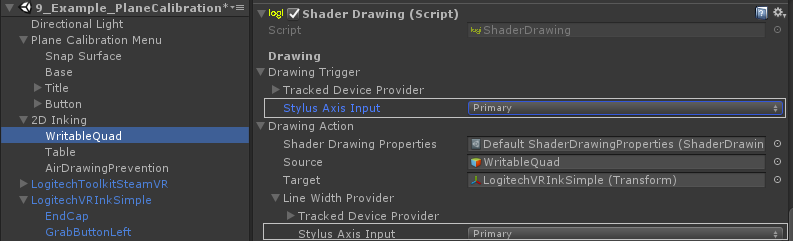
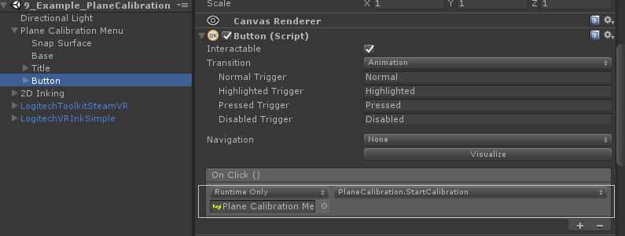

# Plane Calibration

## Interactions

The plane calibration module provides a method of calibrating a plane with a physical surface and creating a virtual surface. Note that it utilizes elements from the [Surface Drawing](./SurfaceDrawing.md) and [Menu Interaction](./MenuInteraction.md) modules.

The implementation for Plane Calibration can be found in the example scene `9_Example_PlaneCalibration` in the `PlaneCalibrationMenu` GameObject.
You can also see it in action in our [Demo Experience](../DemoExperience/Readme.md).

## Implementation

All the heavy lifting happens in the `PlaneCalibration` script attached to the `PlaneCalibrationMenu` GameObject.
 

The Tracked Device is the device you use to position the calibration points, and the` New Point Trigger` is the device and button you use to set each calibration point (3 in total).

`PlaneCalibration` will not create a drawing surface from scratch, it will reposition and resize an existing one that you set as the `Drawing Plane`. Note that the orientation of the plane will also be determined by the forward vector of the HMD; be sure to look in the right direction when calibrating.

Part of the magic of VR Ink is its ability to draw on real, physical surfaces. You can change the `New Point Trigger` to use the VR Ink Tip instead of the primary button. Then you can just press VR Ink on three edges of your physical surface to calibrate it.

To also support writing with the Tip, you can set the `Drawing Trigger` and the `Line Width Provider` in the `ShaderDrawing` component to use the Tip instead of the Primary Button.
 

To make it simple to begin calibrating a plane, we use a 3D button that triggers the calibration.
 

