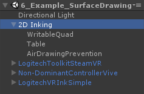
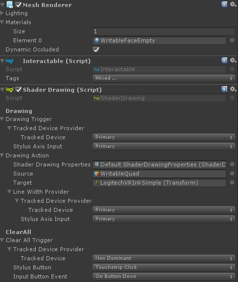
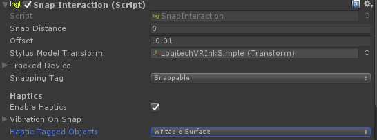
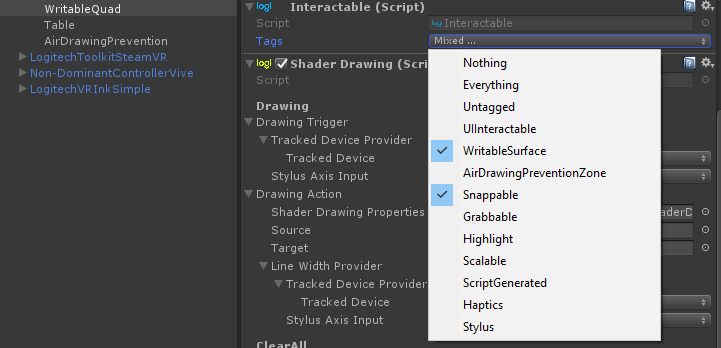

# Surface Drawing

## Interactions

There are 3 interactions in the Toolkit that we present here:

* **Surface Drawing** - Inking on a 2D surface.
* **Undo/Redo** - Undo or redo a line that has been drawn.
* **Snapping** - Snap VR Ink to a surface

The implementation of Surface Drawing can be found in the example scene `6_Example_SurfaceDrawing` in the `2D Inking` GameObject.

## Implementation

You can find the Shader Drawing component in the `WritableQuad` GameObject. To use it, it must also have a MeshRenderer attached. 
 

Shader Drawing has a `Drawing Trigger` that takes the input of a given tracked device, and will execute the `Drawing Action`.

In Drawing Action, `Shader Drawing Properties` define how lines will get drawn. The `Source` should be the surface that we are drawing on and the `Target` is the transform that we are drawing with.

Finally, `Line Width Provider` can be used to get the analog axis value of a button to define the width of the drawn lines.

### Shader Drawing

The 2D drawing functions by using a material to which we assign a custom 2D drawing shader as a texture. When the trigger is active, we capture the VR Ink Tip position on the Shader and change the pixels around it based on the brush mode.

### Undo Redo

As seen in the [Air Drawing module](AirDrawing.md), the implementation of the Undo/Redo feature can be quite simple, it disables or enables a GameObject. For the surface drawing it is a bit more complex as we are using a compute shader to colour each pixel in a texture.

To get around it, the `ShaderDrawingAction` script saves each of the last 24 strokes in a depth layer of the 3D texture. Any time we add a new stroke, we save the state of canvas in one of these texture depth layers, but that texture can only save the last 24 states. Due to this limitation, even the `EraseAll()` function from the IUndoRedo interface can never revert the canvas to its original state. To get around this issue, we implemented a `ClearAll()` function directly as part of the `ShaderDrawingaction` that resets the canvas to a blank state.

### Interacting with the Virtual Plane

When working in a virtual space, there are a lot of elements we are missing from drawing with a pen & paper on a table. For example, there is no force feedback from the virtual plane. You can't press on it, the device would just go through!

We found that these 3 points really help when trying to write on a virtual surface:

* Prevent the VR Ink model from going through the virtual surface.
* To make it even clearer that VR Ink is going touch the virtual surface, we create a shadow on the plane.
* For the user to know that they actually reached the plane, we trigger a haptic pulse when the model snaps or hits the virtual surface. This is unnecessary though if the virtual surface is aligned with a physical one!

You can see that the `LogitechVRInkSimple` prefab contain a `SnapInteraction` component which will snap to each `Interactable` that has a given tag and a Collider attached. It will also trigger a haptic pulse if the element also has the second given tag.
 

By adding the `Interactable` component to our writable plane with these 2 tags, we have the snap and the haptic pulse working.
 

And finally, by adding the `DepthCue` component to the `WritableQuad` GameObject, we get the shadow.
 

