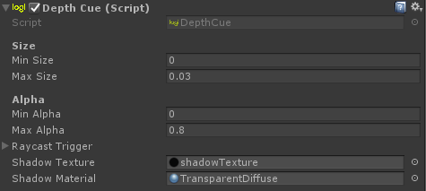

# Surface Drawing

## Interactions

There are currently 3 different interactions in the Toolkit that we present here:

* 2D Inking
* Undo Redo
* Snapping

The implementation of the Surface Drawing can be found in the example scene `6_Example_SurfaceDrawing` in the `2D Inking` GameObject.

If you are interested in knowing more about the Undo Redo, we describe it the [Air Drawing Documentation](AirDrawing.md).

## Implementation

Your scene have to contain a GameObject with a MeshRenderer that also contains a `ShaderDrawing.cs` component script. The `ShaderDrawing` component is an `Interaction`. It takes the input of a given tracked device as a `Trigger`, and then will produce the drawing `Action` by calling `ShaderDrawingAction.cs`.

### Shader Drawing

The concept we use for the 2D drawing is to have a material to which we assign our own Shader as a texture. When the trigger is active, we capture the VR Ink Tip position on the Shader and change the pixels around it accordingly to the brush mode.

[GIF HERE]

### Undo Redo

You can see in the [Air Drawing Documentation](AirDrawing.md) the implementation of the Undo/Redo feature is quite simple: you just turn a GameObject off or on. For the surface drawing it is a bit more complex as we are using a compute shader to color each pixels in a texture.

To go around it, the `ShaderDrawingAction.cs` script saves the last 24 strokes in the layer of a 3D texture. Any time we add a new stroke, we save the state of canvas in the one of the texture depth but that texture can only saves the last 24 states. Due to this limitation, even the `EraseAll()`  can never revert the canvas to its original state. To go around this issue, we implemented a `ClearAll` function directly as part of the `ShaderDrawingaction` that clear all the drawings of the canvas.

### Interacting with the Virtual Plane

When working in a virtual space, there are a lot of elements we are missing from drawing with a pen & paper on a table. For example there are no force feedback from the virtual plane, you can't press on it, the device would just go trough!

We found that these 3 things really helped when trying to write on a virtual surface:

* The first thing to do to create a better experience is to prevent the model of the stylus from going through the virtual surface.
* To make it even clearer that the stylus is going touch the virtual surface, we created a shadow on the plane.
* And finally, for the user to know that he actually reached the plane, we trigger a haptic pulse when the Snapping occur. This is unnecessary though if the virtual surface is aligned with a physical one !

You can see that the `LogitechVRInkSimple` prefab contain a `SnapInteraction` script component. Which will snap to each element that have a given tag, and will also trigger a haptic pulse if the element also have the second given tag.

By adding the `Interactable` script component to our writable plane with these 2 tags, we have the snap and the haptic working.

 And finally by adding the `DepthCue` script component to the `WritableQuad` GameObject, we get the shadow.

