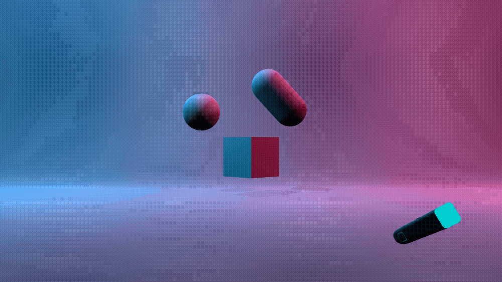
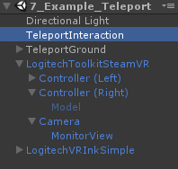
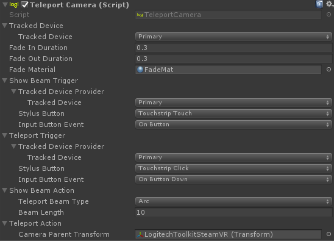
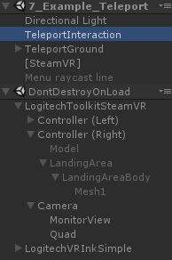
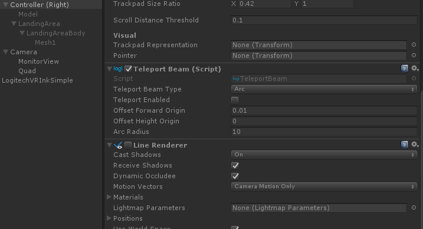
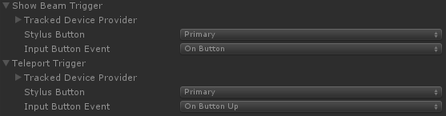

# Teleport

The Teleport module provides a simple way to teleport yourself in the virtual world.

## Teleportation Components

There are 4 distinct components used to create the Teleportation interaction in the Toolkit:

- The teleportation script.
- The teleportation arc.
- The landing area.
- The fading camera.

The implementation of the teleportation module can be found in the example scene `7_Example_Teleport` in the `TeleportInteraction` GameObject.

## Implementation

Every component needed for teleport interaction is generated at runtime from the `TeleportCamera` script.
 

Once you play the scene, you can see that a `Quad` GameObject is created under the `Camera` This quad handles the camera fade while teleporting. The `LandingArea` GameObject, `TeleportBeam` component and `Line Renderer` component is created under the selected tracked device.

### Teleport Camera

There are 2 separate Input Triggers, one to show the teleportation destination teleport beam, and another to trigger the teleport. We use the VR Ink Touchstrip in the example scene because it has both a `TouchEvent` and a `ClickEvent` for each state. You could also use another input, such as the Primary Button as shown below, or possibly retool the interaction to use various pressures for each state.
 

The `Camera Parent Transform` in `TeleportCamera` is the actual object that will be teleported. Ensure that each GameObject you want to be teleported is a child of this GameObject.

### Camera Fading

It can be quite jarring to move a user without fading or using some other method of dampening the effect of motion sickness.  The `TeleportCamera` component uses the `Camera Parent Transform` to find the main camera active in the scene. Once we have found the main camera, we place a quad in front of it that will be used to fade the screen to black during teleportation.

Once the `TeleportTrigger` is valid, a coroutine that fades the screen to black is started. We then teleport the user and the view fades to normal again.

### Possible Improvements

At the moment, the teleportation will always teleport you with the same camera direction and at the same height. Some improvements to teleportation might include:

- Creating a tag for which ground you can teleport on. Then instead of teleporting to height zero, teleport to the position of the intersection of the beam and the ground tagged.
- Adding an indicator, such as an arrow, to suggest the direction of the camera after teleportation. You could adjust this direction by rotating VR Ink.
