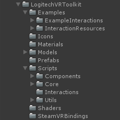
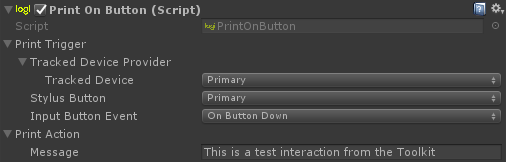

# Toolkit Overview

## Preface

### Work in Progress

The Toolkit, including the Interaction framework that that interactions are built on, is a work in progress. It is likely things will change in the future, which may cause references to be lost or things to not work as expected if updating from an older version.

### Using Interactions

Note that the [interaction scripts](#interactions) provided in the Toolkit are built to be relatively generic, but they are not always a drag and drop solution. You may find it easier to modify these examples in a way that better suit your needs or to use them as a basis for a completely new interaction.

### Toolkit Framework

When you see any references to the 'Interaction Framework' or 'Toolkit Framework', what we are referring to is simply the logical workflow using the [Trigger](#triggers), [Action](#actions) and [Provider](#providers) scripts to create [Interactions](#interactions).

## Toolkit Content



* **Examples**
  * **ExampleInteractions**
    <br>
    The scenes that showcase each interaction module provided in the Toolkit.
  * **InteractionResources**
    <br>
    The resources that are exclusively used in the ExamplesInteractions scenes.
* **Icons**
  <br>
  The images used to represent different types of scripts in the Toolkit.
* **Materials**
  <br>
  Materials required by certain scripts or prefabs.
* **Models**
  <br>
  Base models for VR Ink and the Vive Controller.
* **Prefabs**
  <br>
  Required or common elements used throughout the Toolkit such as a configured VR Ink and a custom SteamVR `[CameraRig]` (`LogitechToolkitSteamVR`) with the Toolkit Manager and Stylus Detection scripts attached.
* **Scripts**
  * **Components**
    <br>
    Scripts used in the Toolkit that don't use the Trigger - Action - Provider framework.
  * **Core**
    <br>
    The base Trigger, Action and Provider scripts along with their concrete implementations.
  * **Interactions**
    <br>
    The interactions built using the Triger - Action - Provider framework.
  * **Utils**
    <br>
    Scripts used to supplement the Toolkit:
      * Attributes
      * PropertyDrawers
      * Enums
      * Extension methods
* **Shaders**
  <br>
  Shaders that can be used for various elements of the Toolkit and ExampleInteractions.
* **SteamVRBindings**
  <br>
  A set of default SteamVR action bindings for VR Ink and the Toolkit.

## Triggers

Triggers may be used to execute actions if certain conditions are met.

```csharp
// Trigger base class - to be implemented when creating custom Triggers.
[Serializable]
public abstract class Trigger
{
    public abstract bool IsValid();
}
```

A Trigger is simply a class that is expected to provide a state that is either true or false. It must implement the `IsValid()` method.

Triggers provided with the Toolkit:
* **CollisionTrigger** - Is valid when a specified CollisionInteractable collides with another that meets some specified conditions.
* **InputTrigger** - Is valid when a specified button is pressed on a provided tracked device.
* **PropertyStateTrigger** - Is valid based on the state of a selected boolean from another specified component.
* **RaycastTrigger** - Is valid when a configured raycast meets a set of conditions.
* **ShakeTrigger** - Experimental trigger that is valid when a target transform shakes.

You can check out any of these Triggers in the Toolkit to get a better understanding of their implementation. They can be found in `Scripts/Core/Triggers`

## Actions

Actions may be used to perform simple events.

```csharp
// Action base class - to be implemented when creating custom Actions.
[Serializable]
public abstract class Action
{
    private bool _risingEdge;

    public void Update(bool isTriggerValid)
    {
        if (isTriggerValid)
        {
            if (!_risingEdge)
            {
                OnTriggerValid();
                _risingEdge = true;
            }

            TriggerValid();
        }
        else
        {
            if (_risingEdge)
            {
                OnTriggerInvalid();
                _risingEdge = false;
            }

            TriggerInvalid();
        }
    }

    public void TriggerOnce()
    {
        OnTriggerValid();
        TriggerValid();
        OnTriggerInvalid();
        TriggerInvalid();
    }

    // Generally used for initialization. Called on rising edge.
    protected virtual void OnTriggerValid() { }
    // Where the main logic happens. Called every frame while isTriggerValid is true.
    protected abstract void TriggerValid();
    // Generally used for resetting variables or destroying objects. Called on falling edge.
    protected virtual void OnTriggerInvalid() { }
    // Where alternate logic happens. Called every frame while isTriggerValid is false.
    protected virtual void TriggerInvalid() { }
}
```

Actions contain reusable logic that causes something to happen, and are generally executed when a Trigger is true. The only method a concrete Action *must* implement is the `TriggerValid()` method. The `OnTriggerValid()`, `OnTriggerInvalid()` and `TriggerInvalid()` methods can be implemented for additional functionality. See the above code block for their purposes.

To ensure consistency in the implementation of Actions, there are some things to consider when using Actions.
* In an interaction using an action, it is expected that `Update()` is called each frame to ensure all states of an Action occurs and that it is initialized and cleaned up correctly.
* If you want to exectute an Action just once, the `TriggerOnce()` method should be used.

You can check out the many Actions provided with the Toolkit to get a better understanding of their implementation. They can be found in `Scripts/Core/Actions`

## Providers

Providers may be used as an abstraction to accessing an object or value.

```csharp
public abstract class Provider<T> : Provider
{
    public static implicit operator Provider<T>(T x)
    {
        return new ConstantProvider<T>(x);
    }

    public virtual void Init() { }

    public abstract T GetOutput();
}
```

Providers can return an object of any type. They can be used to help avoid rewriting boilerplate code, much like a helper method.  When creating a provider, you can implement the `Init()` method if initialization is required. The main logic should be contained in the `GetOutput()` method, which returns a provided output.

```csharp
// An example of a Provider. This Provider is used to get a TrackedDevice with the specified Handedness.
[Serializable]
public class TrackedDeviceProvider : Provider<TrackedDevice>
{
    public Handedness TrackedDevice;

    public TrackedDeviceProvider() { }

    public TrackedDeviceProvider(Handedness trackedDevice)
    {
        TrackedDevice = trackedDevice;
    }

    public override TrackedDevice GetOutput()
    {
        return LogitechToolkitManager.Instance.Devices[TrackedDevice];
    }
}
```

In the future, Providers will become much more useful when it is possible to expect an object of a certain type and allow the selection of any provider in the inspector that returns that type.

You can check out the many providers that come with the Toolkit to get a better understanding of their implementation. They can be found in `Scripts/Core/Providers`

## Interactions

Interactions bind together Triggers, Actions and Providers to create a defined interaction. For example, here is a simple interaction taken from the example scene `2_Example_SimpleInteraction`:

```csharp
// Example.
public class PrintOnButton : MonoBehaviour
{
    [SerializeField]
    private InputTrigger _printTrigger;
    [SerializeField]
    private PrintLogAction _printAction;

    private void Update()
    {
        _printAction.Update(_printTrigger.IsValid());
    }
}
```

Here we have an `InputTrigger` that will get a specified input from a device using the Provider `TrackedDeviceProvider`. In `Update()` we check if the `InputTrigger.IsValid()`. If it is, we call `PrintLogAction.Update(true)` which will print a message while it is true. Otherwise we call `PrintLogAction.Update(false)`.



If we set the Input Button Event in Print Trigger to On Button Down, we can ensure that the Print Action will only print once. If we set it to On Button, Print Action will continually print the message every frame while the button is held. This is because the Action is built to be generic enough to support single or continuous Triggers, and most other Actions should behave in a similar fashion.

All the pre-built interactions can be found in `Scripts/Interactions`

## Components

Components are scripts that don't utilise Trigger - Action - Provider framework. Most components provided with the Toolkit support other functionalities of Toolkit.

Component Folders:

* **Inking** - Contains scripts that support the 2D Inking engine.
* **Interactables** - Contains scripts used to handle interactable objects in the Toolkit such as collisions or custom 3D UI.
* **IO** - Contains scripts that handles the input/output of a device supported by the Toolkit workflow.
* **UIHelpers** - Contains scripts that are used mainly with Unity Events and the 3D UI.
* **UndoRedo** - Contains scripts that handle undo/redo states of objects.

You can check out these components along with others and their usages in `Scripts/Components`.

## Attributes & Property Drawers

Some attributes are provided to improve the look of the inspector. 

```csharp
// Hide a field in the inspector.
public class ExampleClass : MonoBehaviour
{
    public bool HideField;
    [HideIf("HideField")]
    public int ExampleField;
}
```

**DisableIf**
  <br>
  Make a field appear greyed out in the inspector when true.
  <br>
  Usage:
  <br>
  &ensp;[DisableIf(bool)]
  <br>
  &ensp;[DisableIf(FieldAsString)]

**EnableIf**
  <br>
  Make a field appear greyed out in the inspector when false.
  <br>
  Usage:
  <br>
  &ensp;[EnableIf(bool)]
  <br>
  &ensp;[EnableIf(FieldAsString)]

**HideIf**
  <br>
  Hide a field from the inspector when true.
  <br>
  Usage:
  <br>
  &ensp;[HideIf(bool)]
  <br>
  &ensp;[HideIf(FieldAsString)]

**ShowIf**
  <br>
  Show a field from the inspector when true.
  <br>
  Usage:
  <br>
  &ensp;[ShowIf(bool)]
  <br>
  &ensp;[ShowIf(FieldAsString)]

**EnumFlag**
  <br>
  Allow a enum to appear as a BitFlag in the inspector. A BitFlag can have multiple options selected.
  <br>
  Usage:
  <br>
  &ensp;[EnumFlag]
  <br>
  Note:
  <br>
  &ensp;The `HasFlag` extension method can be used with enums to check if an EnumFlag has a specified option selected.

**Label**
  <br>
  Replaces the label of a property in the inspector.
  <br>
  Usage:
  <br>
  &ensp;[Label(string)]

\*FieldAsString refers to a string that is the name of a field in the same script. This will use reflection to get the value of the provided field. See the code example above.

### Property Drawer Limitations

Note that at the moment, usage of these attributes are limited to one per property, they do not stack. For example you cannot hide a property with a [EnumFlag] attribute. A temporary workaround could be to build your own custom attributes and property drawers that combine the functionality of two or more attributes.