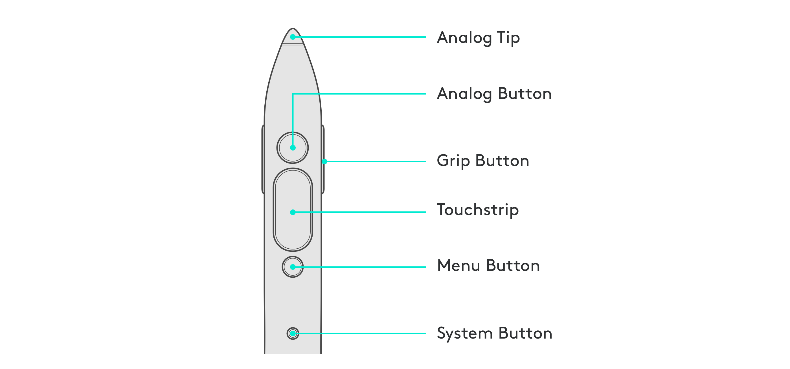
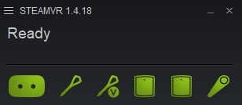

# Logitech VR Ink SDK
This SDK will allow your app to take advantage of all the features of the Logitech VR Ink and give you all the necessary information to help with integration in your app.

The Logitech VR Ink is a simple and powerful creative input device for VR. It allows for creation of precise, controlled lines and handwriting on virtual surfaces, physical surfaces, and in three dimensions.

See below an image of the device and a description of the controls:

### Inputs & Controls

The device features several unique controls, these allow for a large range of potential experiences and interactions.
The key controls are:

| Control | Description | Input Type |
|---|---|---|
| Analog Button | The Analog Button allows for modulated input that can present a range of values. This can be used for creating variable line widths based on the pressure applied to the button. | Returns Value between 0 - 1 |
| Analog Tip | The Analog Tip allows for the creation of lines on physical surfaces that are mapped in VR. This can be used to recreate a drawing surface on a desk or a whiteboard. | Returns Value between 0 - 1 |
| Touch Strip | The Touch Strip allows for the adjustment of a control using up and down swipes. The touch strip is capacitive sensing and has a button to allow for multiple methods of input. | Returns X and Y Value between -1 - 1 The TouchStrip can be clicked |
| Grip Button | The Grip Button on the sides of the device allow users to intuitively pick objects up in VR, and to scale and move objects using a system controller in the non-dominant hand. | Returns True or False |
| Menu Button | The Menu Button is a simple switch that allows menus to be opened and closed. The button can be long-pressed to access the 6Dof Gestural Control | Returns True or False |
| System Button | The System button allows for access to the SteamVR shell. | Returns True or False |

## Repository Contents
If you don't own a Logitech VR Ink, ask for it [here!](https://www.logitech.com/en-roeu/promo/vr-ink.html)

Available Directly in the Repo:

- [Getting Started on the Logitech VR Ink Integration](/code/GettingStarted.md)
- [Sample Unity application](code/unity_sample_app) open source showing best practice to integrate the device in your application
- [Unreal Engine documentation](/code/unreal_sample_project) for device support

Available in the [Release](https://github.com/Logitech/labs_vr_pen_sdk/releases):

- [SteamVR Driver](/code/stylus_driver/ReadMe.md)
- Unity package source code to be used for the integration of the stylus in your app
- Unreal Engine full project
- 3D Models in FBX format with several textures

## Setting Up The Stylus

#### Installing the Driver
Download the Logitech VR Ink driver on the [releases page](https://github.com/Logitech/labs_vr_pen_sdk/releases), make sure SteamVR is closed, run the application and follow the instructions on screen. For more in depth instructions have a look at the [dedicated driver page](/code/stylus_driver/ReadMe.md).
This will install the Logitech VR Ink driver and add the correct SteamVR render model as well as the the correct SteamVR icons and support for the SteamVR Input Bindings.
 
**Note: if SteamVR Home is enabled you will not see the model of the stylus, for that you need to be in the SteamVR Shell**

### Pairing the Stylus

 
First turn on the Logitech Stylus by pressing the system button, status LED will go blue. Then you go into SteamVR right click on any controller icon and then select *Pair Controller*. Press both the Menu and Power buttons together, the status LED will blink BLUE, and it will be solid GREEN on the stylus once pairing is complete.
 

### Trying out the Stylus
You are now ready to go. The stylus should work with existing SteamVR applications in the same was as a Vive controller.
If you want to try a fully integrated application I recommend you to try out the [Logitech Sample app](resources/ShowcaseApplication/LogitechVRInkShowcase.md) available in the [Release](https://github.com/Logitech/labs_vr_pen_sdk/releases).
 
You can also get started with the device in Unity by either cloning this repository or downloading the Unity Package available in the [Release](https://github.com/Logitech/labs_vr_pen_sdk/releases).

## Feedback & Bugs

We are working constantly to improve and address issues with the device, so please make sure you have the latest release of SDK installed and running.

We also value your input on:
- possible bugs
- shortcomings
- issues
- incompatibilities

as well as:
- enhancements ideas
- possible new features

We strongly suggest to use our private GitHub repository for bug reports and features requests. Follow this [link](https://github.com/Logitech/labs_vr_pen_sdk/issues) and post it there.

 

## License
Copyright (c) Logitech Corporation. All rights reserved.
Licensed under the MIT License.

