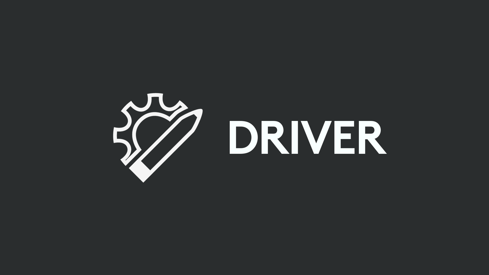

# Logitech VR Ink SDK
Logitech VR Ink Pilot Edition is a first-generation VR stylus for enterprise, coming later this year. Simple to use from the moment you pick it up, it offers control and precision, unleashing your creativity in VR, on two-dimensional physical surfaces or in three-dimensional room-scale space

Here you will find everything you need to get started including first installation; integrating with Unity, Unreal, or your own platform; and a set of interaction examples.

## SDK Contents

## Demo Experience

We strongly recommend that you try our [demo experience](./Documentation/DemoExperience) after setting up the VR Ink. It showcases several interactions that are unique to the VR Ink.

## Required Software
|  **SteamVR 1.4.18** |
|---|
| This is the minimum required version of SteamVR that fully supports the VR Ink. |

## Get In Touch
**Partners**
 
If you're looking to partner with us on the VR Ink, please [visit our website](https://www.logitech.com/en-roeu/promo/vr-ink.html#contact) and fill out the contact form.

**Feedback**
 
We are always working to improve the VR Ink and address issues, we would love to hear your feedback!
*  [Search for or file a new issue](https://github.com/Logitech/labs_vr_stylus_sdk/issues) if you find any problems with the VR Ink SDK.
*  If you have any ideas or feature requests regarding the VR Ink SDK, feel free to create an new issue and label it as enhancement

## License
Copyright (c) Logitech Corporation. All rights reserved.
Licensed under the MIT License.
