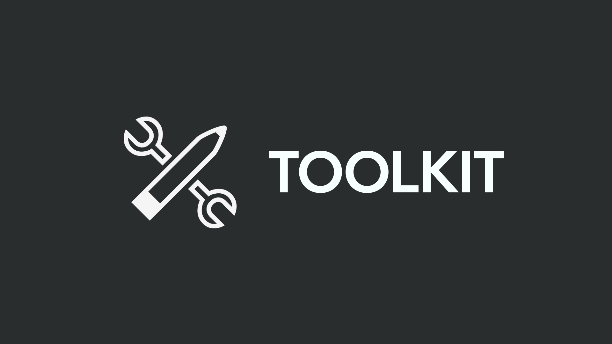

# What is the Logitech VR Ink SDK

[Logitech VR Ink Pilot Edition](https://www.logitech.com/en-roeu/promo/vr-ink.html) is a first-generation VR stylus for enterprise, coming later this year. Simple to use from the moment you pick it up, it offers control and precision, unleashing your creativity in VR, on two-dimensional physical surfaces or in three-dimensional room-scale space. This SDK will allow your VR app to take advantage of all the features of VR Ink.

Here you will find:

- A guide to getting started, including initial installation.
- How to integrate with Unity, Unreal, or your own platform.
- Recommended design guidelines for VR Ink.
- A set of example interaction blocks.

## Required Software

|  **Windows 10** |  **SteamVR 1.4.18** |  **Unity 2017 LTS** |  **Unreal 4.19** |
| :--------------------------------------------------------------------------------------------------- | :------------------------------------------------------------------------------------------------------- | :------------------------------------------------------------------------------------------------------- | :-------------------------------------------------------------------------------------------------- |
| You are developing your VR app in Microsoft Windows 10 64-bit.                                       | This is the minimum required version of SteamVR that fully supports VR Ink.                              | You can use Unity to work with VR Ink. This is the Unity version used by the SDK.                        | You can use Unreal Engine to work with VR Ink. This is the Unreal Engine version used by the SDK.   |

## SDK Content

### Demo Experience

A demo is worth a thousand words! We recommend that you try out the [demo experience](./Documentation/DemoExperience/Readme.md) that we have crafted to showcase some interesting and unique use cases with VR Ink. You will be able to experience three different scenarios:

- Free drawing on a surface, and in 3D, with pressure control.
- Review and annotate an architectural plan.
- Sculpt a 3D head in VR.

## Get in Touch

### Partners

If you're looking to partner with us on VR Ink, please [visit our website](https://www.logitech.com/en-roeu/promo/vr-ink.html#contact) and fill out the contact form.

### Feedback

We are always working to improve VR Ink and address issues, we would love to hear your feedback!

- [Search for, or file, a new issue](https://github.com/Logitech/vr_ink_sdk/issues) if you find any problems with VR Ink or the SDK.
- If you have any ideas or feature requests regarding VR Ink or the SDK, feel free to create an new issue and label it as 'enhancement'.

### Troubleshooting

- If you experience any problem with your VR Ink device, have a look at the [FAQ section](./Documentation/FAQ/Readme.md).
- If this does not solve your problem you can contact us at [vrinksupport@logitech.com](mailto:vrinksupport@logitech.com).

# License

Copyright (c) 2019 Logitech, Inc.
Licensed under the [MIT License](./License.md).
