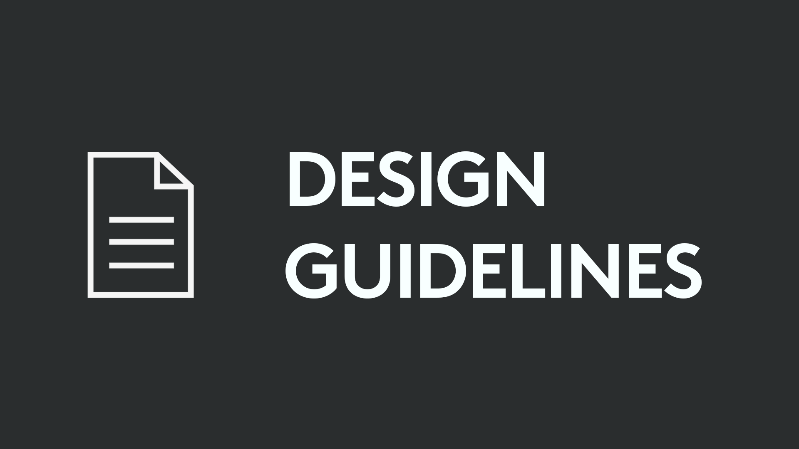

# What is the Logitech VR Ink SDK
This SDK will allow your VR app to take advantage of all the features of our stylus in VR: [Logitech VR Ink Pilot Edition](https://www.logitech.com/en-roeu/promo/vr-ink.html) is a first-generation VR stylus for enterprise, coming later this year. Simple to use from the moment you pick it up, it offers control and precision, unleashing your creativity in VR, on two-dimensional physical surfaces or in three-dimensional room-scale space

Here you will find everything you need to: 
- get started including first installation
- integrating with Unity, Unreal, or your own platform
- some recommended design guidelines
- set of interaction blocks examples

# Required Software
|  **Windows 10** |  **SteamVR 1.4.18** |  **Unity 2017 LTS** |   **Unreal 4.19** |
|---|---|---|---|
| You are developping your VR app in Microsoft Windows 10 64bit | This is the minimum required version of SteamVR that fully supports the VR Ink. | You can use Unity to develop your VR app for the stylus. | You can use Unreal Engine to develop your VR app for the stylus |

# SDK Contents

# Sample Demo App
A demo is worth a thousand words! We recommend for you to try out the [demo app](./Documentation/DemoExperience) that we have crafted to showcase some interesting and unique usecases with VR Ink. You will be able to experience three different scenarios:
- Free drawing on a surface and in 3D with pressure support
- Review and annotate an architectural plan
- Sculpt a 3D head in VR

# Get In Touch
**Partners**
 
If you're looking to partner with us on the VR Ink, please [visit our website](https://www.logitech.com/en-roeu/promo/vr-ink.html#contact) and fill out the contact form.

**Feedback**
 
We are always working to improve the VR Ink and address issues, we would love to hear your feedback!
*  [Search for or file a new issue](https://github.com/Logitech/labs_vr_stylus_sdk/issues) if you find any problems with the VR Ink SDK.
*  If you have any ideas or feature requests regarding the VR Ink SDK, feel free to create an new issue and label it as enhancement

# License

Copyright (c) 2019 Logitech, Inc.
Licensed under the MIT License.
