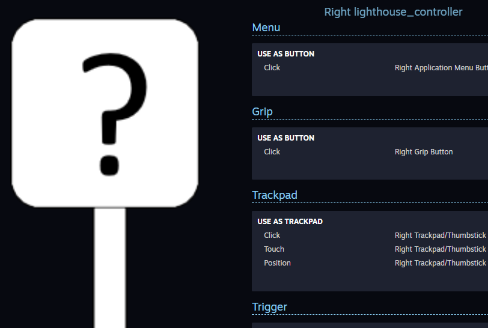

## Known Issues

The Logitech Stylus is still in development and as such doesn't support all the latest feature from OpenVR and SteamVR:
- In SteamVR Home the Logitech Stylus is not displayed, instead you will see a Vive Controller. If you want to see the Stylus render you need to be in the **shell**
- The Logitech Stylus suffers from the same issue as existing Vive or Knuckles controller regarding LED status and other charging problem and pairing issues.
- Right now the Nib of the Stylus and the Primary button are using the same channel to report their analog values
- The Stylus is not fully supported in SteamVR Input 2.0, as such when looking at creating a specific binding for the stylus you would be greeted by this:

