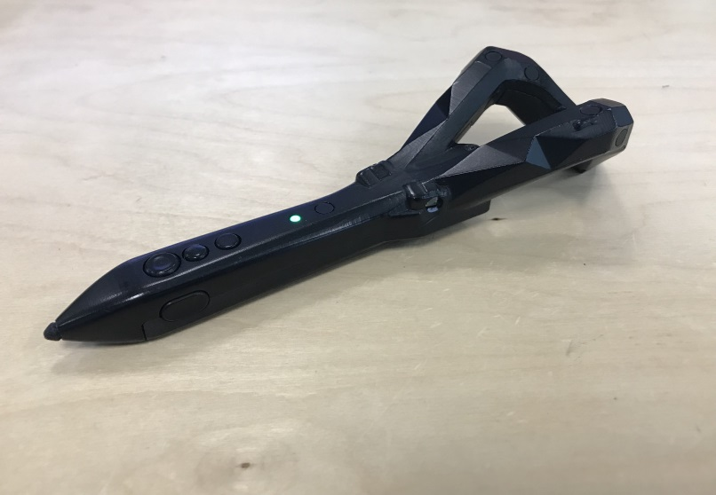
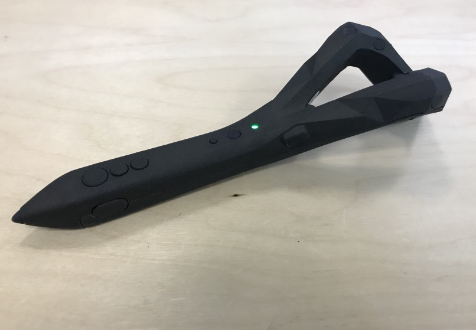

# Pen Render Model

This folder contains the current render models for the different revisions of the pen. When trying to detect if a pen is present in the application, refer to the information on this page to ensure you are checking the correct property.

## Adding render model to SteamVR

### Use the installer

Simply download and unzip [logi_pen_mode_installerl.zip](https://github.com/Logitech/labs_vr_pen_sdk/releases), run the executable file and follow the instructions. Feedback on this procedure is appreciated!

### Manually add render model to SteamVR

Copy the `logi_pen` folder to the appropriate SteamVR sub-folder. Typically the path is something like this `C:\Program Files (x86)\Steam\steamapps\common\SteamVR\resources\rendermodels`

## SteamVR property for each device 

|      |  Description    | Manufacturer    |   Model Number   |    RenderModel Name |
|------|----------------|------------------|-----------------------|-------------------|
|| This version has  a glossy finish and smooth texture. The Power button is underside the pen, below the primary button. **This version has no haptics**     |`Logitech`      |`logi_pen_v2.0`      | `logi_pen`       
| |  This version has  a rough finish. Power button is on the top next to the LED. Haptics are included  |`Logitech`      |`logi_pen_v3.0`      | `logi_pen`   
