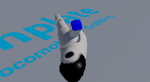
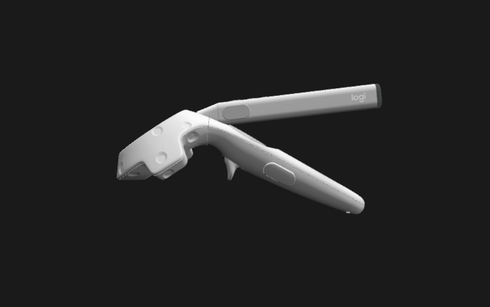

This Unity Project is to work with the deprecated [SteamVR Plugin](https://github.com/ValveSoftware/steamvr_unity_plugin/releases/tag/1.2.3) that **is not using SteamVR 2.0 and action maps**.

# Logitech Stylus Detection
To detect that the Logitech Stylus is actually connected when you start up your application you can ask SteamVR what are the device properties of a specific `SteamVR_Tracked_Object`.
In the scene `Sample_PenAutoDetect` there's an example of how to do this:
 

We recommend that you use the **ModelNumber_String property** to detect if the pen is connected. You can detect the if the stylus is connected using the *logitech_stylus_v4.0* string. When you have the game window in focus you can **press P** on the keyboard to print the different property strings in the Unity console.

# Grip Pose Versus Pointer Pose
## Prerequisite Reading on Pose
It is important to be familiar with the Microsoft documentation ( [grip vs pointer pose](https://docs.microsoft.com/en-us/windows/mixed-reality/gestures-and-motion-controllers-in-unity#grip-pose-vs-pointing-pose)) regarding the different type of poses that you could define for a 6DOF controller. This document references **Pointer Pose & Grip Pose** through the rest of the content.

## Logitech Stylus 3D model poses
In the scene `Sample_GripPoseVSPointerPose`, you will find a Logi Pen Prefab that has two transforms: `Pointer pose` and `Grip Pose` in the hierarchy of the pen. If your application **displays real hands** it is recommended to use the `Grip Pose` transform to display the 3D model of the hands.
 

In the two following GIFs the Hand and the Vive controller represent the `Grip pose`. The Pen in both of these would be the `pointer pose`.
 
 

