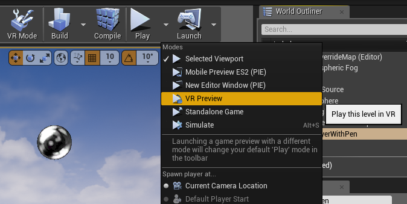
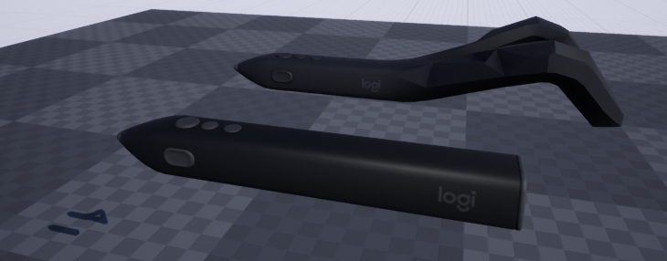
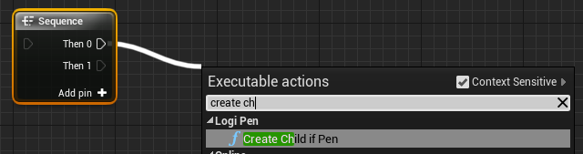
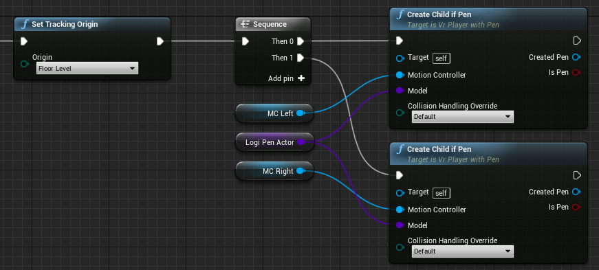
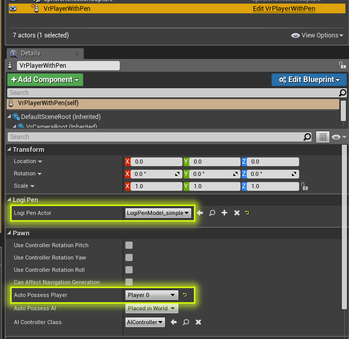

# Logi Pen UE4 SDK

## How to use

Keep in ming that this SDK is a reference implementation rather than a toolbox. While you are more than welcome to re-use parts of this (provided you follow the terms of this repository's licence), we this project as a simple example.

Unzip [LogiPenUnrealSDK.zip](https://github.com/Logitech/labs_vr_pen_sdk/releases) somewhere on your machine and double click on `LogiPenUnrealSDK.uproject`. Unreal Engine will then open the project and, after compiling everything, you should be able to try out the Logi Pen in UE4! Make sure to use VR Preview, as shown below:

## Content

This section describes the main components, pieces of code, blueprints, and assets contained in this SDK.

### Pen models

We provide you with two models of the pen: a full mesh and a simplified one.

If your application doesn't require the users to quickly move around--at the risk of hitting something with the tracking geometry of the pen--we recommend using the simple model. We suggest you try to use the tab at the end of the pen as an additional UI element: this could for instance be the current ink colour, or pulse when the user's attention is needed elsewhere in your app.

### VR Player With Pen

This Blueprint is a Pawn and was put together following the step-by-step guide in the section below.

### Create Child if Pen

A rather simple blueprint function graph determining if a given Motion Controller is a Logi Pen, in which case it hides its default model and replaces it with the pen model specified in the Pawn.

### C++ code

Intentionally kept very simple, the few lines of code included in this SDK can be found in `Source/LogiPenUnrealSDK/LogiPenModelOverride.cpp`. There are two functions, called in the function graph described above.

## Adding Logi Pen Motion controller to your scene

This is a way to add the Logi Pen to a scene using the assets contained in this project:

* Configure a VR Player Pawn: [UE Doc](https://docs.unrealengine.com/en-US/Platforms/SteamVR/HowTo/StandingCamera)
* Configure left and right motion controller, including component visualization (this is important to detect which controller is the Logi Pen): [UE Doc](https://docs.unrealengine.com/latest/INT/Platforms/VR/MotionController)
* In the pawn's Event Graph, after `Set Tracking Origin`, add a `Sequence`, and add a `Create Child if Pen` to both outputs:

  

* Under My Blueprint, add a new variable, call it LogiPenActor, make it public, and of type Actor > Class Reference. Then drag & drop it on the event graph, select "Get LogiPenActor".
* Drag & drop your left and right Motion Controllers, also select "Get ..."
* Link these items in the following way:

  

* Return to your map, drop the VR pawn, make sure it is at the origin, set it as auto possess player 0, and use LogiPenModel_simple as Logi Pen Actor. This Actor is the one that will override the default model coming from SteamVR

  
