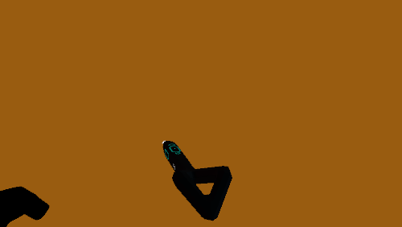
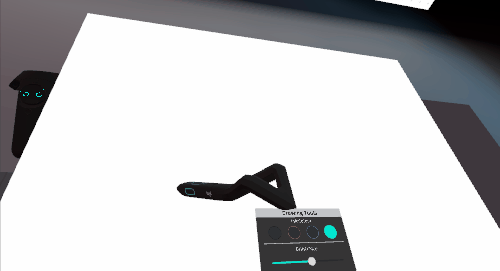

# Logitech VR Ink Showcase

This application is meant as the first contact experience when using the Logitech VR Ink. It showcases several interactions that are unique to the stylus.
Go to the [release page](https://github.com/Logitech/labs_vr_stylus_sdk/releases) to find the latest version.

## Calibrating the Space

This application has been design to allow the user to calibrate the virtual canvas with any real 2D surface. The virtual canvas is the same size as a standard A1 page.
Press **Shift+[** to go into calibration mode. Then click the touchstrip on the stylus on the 3 corners of you desired space.
 

 

## Drawing Experience

 
Once the surface is calibrated you can draw in 2D by pressing the tip of the stylus on the physical surface, or you can draw in the air by press the main analog button. The harder you press the thicker the line.
The brushsize Slider will change the maximum thickness of the line.

## Markup Experience

 
On top of being able to write in the air and on the 2D surface you can also write on the 3D Model. The house can be dragged around when pressing the grip button on the stylus, and scaled and rotated when engaging the grip on the vive controller.
You can create callouts by selecting the callout button on the UI and then by pressing on the main button twice.

## Sculpting Experience

 
In this demo you can move vertices around on the main button on the stylus. There's 3 modes available, adding, subtracting and blending. The harder you press the bigger the effect on the mesh.

## ShortCut List

| Shortcuts                        | Effect                                                                                                      | NOTES                                            |
|----------------------------------|-------------------------------------------------------------------------------------------------------------|--------------------------------------------------|
| Shift + [                        | The environment will change. Use the nib to point at the corners of the plinth and  click the touch strip . |                                                  |
| 1                                | Switch to Drawing Experience                                                                                |                                                  |
| 2                                | Switch to Markup Experience                                                                                 |                                                  |
| 3                                | Switch to Sculpting Experience                                                                              |                                                  |
| 4                                | Swap controllers Handedness                                                                                 | Useful only if no Stylus detected by application |
|  Vive controller   Trackpad Left | undo                                                                                                        |  1 second press to clear everything              |
| Vive controller   Trackpad Right |  redo                                                                                                       |                                                  |

